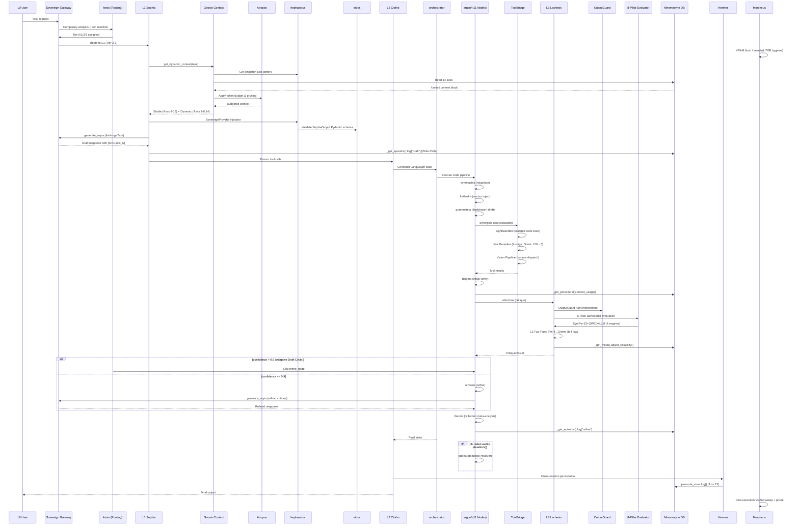

# Phantom Logos: System Topography & Micro-Level Data Flow

*Status: v1.1.34 - MCP Ecosystem Pipeline Repair & CI/CD Integration, 0 Layer Violations, System STABLE*

This document provides a high-fidelity mapping of the Phantom Logos Agentic OS, detailing module interactions, data persistence across the 14-axis Mnemosyne memory, and the Sovereign Gateway architecture.

---

## 1. Executive Agent Hierarchy (L1-L3)

The system operates on a 3-Tier hierarchical structure (RuFlow) ensuring high-reasoning strategy is decoupled from deterministic execution and sovereign verification.

```mermaid
graph TB
    subgraph L0["L0 — User Authority"]
        L0[L0: Hank]
    end

    subgraph GW["Sovereign Gateway Layer"]
        IDE[Antigravity IDE] -->|:32553| SGW[Sovereign GatewayArchitrave]
        SGW -->|Circuit Breaker 60s| CB{Circuit Breaker}
        CB -->|Open| MR[model_registry]
        CB -->|Open -> Fail| MO[MockResponse]
        MR -->|Capability Resolution| KR[krisis — Routing]
        OPC[OpenCode CLI] -->|Axis 13| SGW
    end

    subgraph L1["L1 — Sophia (Strategy)"]
        KR -->|Tier 0-3| SOPHIA[Sophia — Strategist]
        SOPHIA --> GNO[Gnosis — 14-Axis Context Assembly]
        SOPHIA --> TEL[telos/ — 4 Draft Modules]
        SOPHIA --> HES[hestia/ — 3 Singleton Modules]
        SOPHIA --> EID[eidos — 5 Pydantic Schemas]
        GNO --> ANK[Ankyra — JIT XML Anchors]
    end

    subgraph L2["L2 — Clotho (Execution)"]
        KR -->|Tier 0-2| ORC[orchestrator — LangGraph]
        ORC --> ERG[ergon/ — 11 LangGraph Nodes]
        ORC --> CLOTHO[Clotho — Executor]
        ORC --> ATROP[Atropos — Context Engineer]
        ATROP -->|Token Budget| AX12[Axis 12: Efficiency]
        ERG --> TB[ToolBridge]
        TB --> SBX[LightSandbox]
        TB --> JIN[Jina Reranker v3]
        TB --> FL[File Changelog]
        ACT[ActivityMonitor] --> ORC
    end

    subgraph L3["L3 — Lachesis (Audit)"]
        ORC -->|Critique| LACH[Lachesis — Auditor]
        LACH --> VER[verifiers/ — SymPy+Z3+QWED+LLM]
        LACH --> OG[OutputGuard]
        LACH --> EVL[8-Pillar Evaluator]
        LACH --> ST[SelfTuner]
        LACH --> HERM[Hermes — Bridge Auditor]
        HERM --> AX13[Axis 13: Cross-Session]
    end

    subgraph MEM["Mnemosyne — 14-Axis Memory"]
        direction LR
        AX1[Axis 1: Episodic<br/>SQLite WAL] --- AX2[Axis 2: Procedural<br/>SQLite]
        AX3[Axis 3: Goal<br/>SQLite] --- AX4[Axis 4: Temporal<br/>SQLite]
        AX5[Axis 5: Spatial<br/>266 modules] --- AX6[Axis 6: Semantic<br/>LanceDB+FTS]
        AX7[Axis 7: Operational<br/>SQLite+Sweeper] --- AX8[Axis 8: Meta-Cog<br/>SQLite]
        AX9[Axis 9: Tone<br/>ToneStore] --- AX10[Axis 10: Rational<br/>SQLite]
        AX11[Axis 11: Verification<br/>SymPy+Z3+QWED] --- AX12
        AX13 --- AX14[Axis 14: Visual<br/>SQLite+VisualStore]
    end

    subgraph SHIELD["Sovereign Shield"]
        SW[Snapshot Guardian — 30s SHA-256] --> SND[(snapshots.db)]
        WD[Integrity Watchdog — 30s poll] -->|Atomic Rollback| SW
        LT[L0 Auth Token — 60s TTL] -->|Override| WD
        WD --> FL
    end

    subgraph INFRA["Local Infrastructure"]
        OLL[Ollama API :11434]
        LOC[LocalRuntime — llama.cpp]
        NOM[Nomic Embed MoE]
        subgraph VIS["Vision Pipeline"]
            V14[VisualStore] --> VL[Qwen2.5-VL (Default)]
        end
    end

    subgraph STORES["Data Stores"]
        MDB[(mnemosyne.db)]
        SPD[(spatial.db)]
        RDB[(reliability.db)]
        OPD[(opencode.db)]
        LDB[(lancedb/)]
        CHK[(langgraph_checkpoints.sqlite)]
    end

    L0 -->|Request| IDE
    GNO <-->|14 Axes Read| MDB
    SOPHIA -->|Axis 1 Write Path| AX1
    CLOTHO -->|Axis 2 Tool Usage| AX2
    LACH -->|Axis 11 Formal Ver| AX11
    MORPH[Morpheus — VRAM Manager] -->|7GB Hygiene| OLL
    MORPH -->|DB Pruning| MDB
    MORPH -->|VRAM Metrics| AX7
    TB -->|Spatial Graph| AX5
    TB -->|Semantic Recall| AX6
    TB --> V14
    SGW -->|Fallback| OLL
    SGW -->|Fallback| LOC
    SW --> MDB
    SOPHIA -->|Skill Injection| TB
    LACH -->|Audit Feedback| SOPHIA
    LACH -->|Audit Feedback| CLOTHO
    ORC --> LACH
```

| Layer | Agent | Role | Model Tier | Axis Anchor |
| :--- | :--- | :--- | :--- | :--- |
| **L1** | **Sophia** | Strategist | Sovereign Gateway (Cloud) / Qwen 3.5 4B (Local) | Axis 10 (Rational) |
| **L2** | **Clotho** | Executor | Qwen 3.5 4B UD | Axis 2 (Procedural) |
| **L3** | **Lachesis** | Adversarial Auditor | Phi-4 Mini Reasoning / Qwen 2.5 Coder 3B | Axis 11 (Verification) |
| **L2** | **Atropos** | Context Engineer | Deterministic / Tiktoken | Axis 12 (Efficiency) |
| **L2** | **Morpheus** | VRAM Manager | Deterministic / Nvidia-SMI | Axis 7 (Operational) |
| **L3** | **Hermes** | Bridge Auditor | CLI / Cross-Session | Axis 13 (Cross-Session) |
| **L2** | **Sophia-14** | Vision Pipeline | Qwen2.5-VL (Default) / MiMo-VL-7B-RL (Flagship) | Axis 14 (Visual) |
| **L0** | **FunctionGemma** | Tool Dispatcher | FunctionGemma 270M (Tier 2, on tool dispatch) | Axis 2 (Procedural) |

---

## 2. Sovereign Gateway Architecture

All cloud traffic routes through a single sovereign proxy layer, eliminating multi-client mismatch and external data leaks.

```mermaid
graph LR
    A[Sophia / Pydantic AI] -->|GoogleModel provider=gw.get_provider()| B[GatewayArchitrave]
    C[Manual reasoning calls] -->|generate_async| B
    B -->|SovereignProvider wraps genai.Client| CB{Circuit Breaker 60s}
    CB -->|Open| D{ANTIGRAVITY_GATEWAY_URL}
    D -->|localhost:32553| E[Antigravity IDE Proxy]
    E -->|Secure Tunnel| F[Cloud Model Provider]
    CB -->|Open -> Fail| MO[MockResponse]
    B -->|async_retry on 500/503| CB
    B -->|Fallback if Gateway fails| G[Local Ollama / Muscle]
    G -->|http://localhost:11434| H[Ollama API]
```

### Gateway Components

| Component | File | Responsibility |
|-----------|------|---------------|
| `GatewayArchitrave` | `src/architrave/gateway_client.py` | Unified gateway client with SovereignProvider |
| `SovereignProvider` | `src/architrave/gateway_client.py` | Pydantic AI compatible provider wrapping genai.Client |
| `SovereignProvider.get_provider()` | `gateway_client.py:86` | Returns configured provider for GoogleModel injection |
| `CircuitBreaker` | `src/architrave/kratos.py` | Circuit breaker + 60s cooldown + async_retry/retry + build_safety_settings |
| `NomosSyncGateway` | `src/architrave/nomos.py` | Sync generate() + MockResponse + local_distill + _local_fallback |
| `AriadneAsyncGateway` | `src/architrave/ariadne.py` | Async generate_async() + context caching integration |
| `ANTIGRAVITY_GATEWAY_URL` | Env var / `gateway_client.py:68` | `http://localhost:32553` — local proxy endpoint |
| `api_key` | `gateway_client.py:72` | `"antigravity-native"` — dummy key for IDE routing |

### Key Design Decisions

- **Single-headed architecture:** Both Pydantic AI (`GoogleModel`) and native `GatewayArchitrave.generate_async()` use the same `genai.Client` instance, preventing context mismatch after 20-30 iterations.
- **SovereignProvider hijack:** Pydantic AI believes it is using a standard Google model, but all traffic routes through the local gateway.
- **Zero external dependency:** `gateway.pydantic.dev` is never called. All cloud traffic goes through `localhost:32553`.
- **Backward-compatible keys:** `GATEWAY_API_KEY` is the primary key; `GEMINI_API_KEY` is auto-mapped for legacy support.

---

## 3. Mnemosyne: 14-Axis Memory Topography

Mnemosyne maintains OS agility via autonomous pruning and strict 7GB VRAM hygiene. Each axis represents a distinct memory type with dedicated storage technology and lifecycle management.

| Axis | Name | Technology | Responsibility | Write Path |
| :--- | :--- | :--- | :--- | :--- |
| **1** | **Episodic** | SQLite (WAL) | Session event history and agent step logging. | `_get_episodic().log()` per Sophia step |
| **2** | **Procedural** | SQLite | Tool usage patterns and successful execution routes. | `_get_procedural().record_usage()` per tool call |
| **3** | **Goal** | SQLite | Active objectives and task state tracking. | `_get_goals().update()` per phase |
| **4** | **Temporal** | SQLite | Time-series event sequences and latency metrics. | `_get_temporal().record()` per operation |
| **5** | **Spatial** | SQLite | CodebaseMapper with AST parser + SQL LIKE optimization. Incremental remap with prune support. 266 modules, 10 circular dependencies detected. Persisted to `spatial.db`. | `_get_spatial().record_dependency()` on scan |
| **6** | **Semantic** | LanceDB + Hybrid | Vector + FTS (RRF Merge) + Jina Reranker (v3). | `_get_semantic().store()` per memory |
| **7** | **Operational** | SQLite + Sweeper | VRAM metrics, DB Pruning (30d retention), telemetry. Pruning implemented in `sweeper.py::_prune_sqlite()` — `operational_logs_v2` table, 30d cutoff. Axis 13 opencode.db files pruned separately via same sweep cycle. | `_get_sweeper().log()` periodic |
| **8** | **Meta-Cog** | SQLite | Behavioral reliability tracking, execution failure analysis, agent success rates. | `_get_meta().adjust_reliability()` + `failure_memory` |
| **9** | **Tone** | ToneStore | Persona and communication style tokens. | Auto-updated via interaction analysis |
| **10** | **Rational** | SQLite | Formal logic, governance rules (`rules.json`), decision trees. | `_get_store().record_fact()` per governance rule |
| **11** | **Verification** | SymPy + Z3 + QWED + LLM | Sovereign local verification of mathematical/logical claims and expressions. [Phase 1.0.24: Asynchronous Pipeline + 7 New Math Models] | `sympy_verifier.verify_expression()` per technical claim |
| **12** | **Efficiency** | SQLite + axis_12_cache_metrics | Context caching (Axis 12) with Gemini implicit cache tracking. Metrics table logs request count, cached tokens, avg latency, hit/partial/miss distribution per session. | `gateway_client.generate_async/generate()` auto-logged |
| **13** | **Cross-Session** | SQLite (External) | Cross-session bridge and inter-session pattern recognition (OpenCode). | `opencode_store.log()` via Hermes CLI |
| **14** | **Visual** | SQLite + VisualStore | VLM output storage with Nomic text embedding. 50-entry LRU retention, 30-day TTL. | `VisualStore.store_vision()` per vision call |

### Context Assembly (gnosis.py)

The `get_dynamic_context()` function in `cognition/sophia/gnosis.py` collects data from all 14 axes and assembles them into a unified context block with standardized `### MNEMOSYNE AXIS N` labels for consumption by Sophia and Pydantic AI.

```python
# Pseudocode flow
context = ""
context += _build_axis_1()   # Episodic History
context += _build_axis_2()   # Procedural Tools
context += _build_axis_3()   # Active Goals
context += _build_axis_4()   # Temporal Metrics
context += _build_axis_5()   # Spatial Codebase
context += _build_axis_6()   # Semantic Memory
context += _build_axis_7()   # Operational Telemetry
context += _build_axis_8()   # Meta-Cognition
context += _build_axis_9()   # User Tone
context += _build_axis_10()  # Rational Governance
context += _build_axis_11()  # Logical Verification
context += _build_axis_12()  # Efficiency Cache
context += _build_axis_13()  # Cross-Session Patterns
context += _build_axis_14()  # Visual Memory (VLM outputs)
```

---

## 4. Micro-Level Data Flow (Task Lifecycle)

### Full Request Lifecycle



### Future Features (Post 1.0.17)

| Feature | Status | Description |
|---------|--------|-------------|
| LightSandbox | Completed | `src/utils/sandbox.py` — isolated code execution |
| Morpheus Config B | Completed | 4 model-set VRAM management (Default/Vision/Fast/Verify) |
| L3 Two-Pass Verification | Completed | Phi-4 Mini → low confidence → Qwen-7b verify |
| Ultra-Light L0 Tier | Completed | deepseek-1.5b as Tier 0 for rapid response |
| Modular Refactoring | Completed | ergon/bridge/gnosis/verifiers/mapper/eidos — 6 packages extracted from monoliths (Phase 11.19.5) |
| Gateway Hardening | Completed | Circuit breaker, 60s local fallback, MockResponse on failure, sweeper health check (Phase 11.19.6) |
| Path Standardization | Completed | 11 Mnemosyne stores migrated to absolute path anchoring — ghost DBs eliminated (Phase 1.0.4) |
| Circular Dep SSOT | Completed | base_models.py created as circular dependency resolver (Phase 1.0.4) |
| Snapshots DB Recovery | Completed | 857MB -> 16KB, zombi watchdog termination (Phase 1.0.5) |
| LSP Restoration | Completed | Pyright installed, Opencode semantic analysis fixed (Phase 1.0.5) |
| Sovereign Gate Hardening | Completed | CONSTITUTION.md SSOT, L0 Auth Protocol, Ollama hybrid reranker (Phase 1.0.6) |
| Foundation Stability | Completed | ToolBridge remediation, GraphState cleanup, Ebbinghaus decay (Phase 1.0.7) |
| Gateway SPOF Hardening | Completed | Circuit breaker with ConnectError, TinyLlama fallback, 300s tick (Phase 1.0.8) |
| Purification & Cycle Break | Completed | Editable package, Pyright portability, BA-01 sweep (Phase 1.0.9) |
| Resilient Shutdown | Completed | SIGINT/SIGBREAK handlers, WAL flush, StateSnapshot recovery (Phase 1.0.10) |
| WAL Checkpoint Optimization | Completed | Thread-safe write counter + PRAGMA wal_checkpoint(TRUNCATE) (Phase 1.0.11) |
| Agent Contextual Awareness | Completed | system_status.json flag, SYSTEM CRITICAL context injection (Phase 1.0.12) |
| Semantic Hardening | Completed | Real Ollama embeddings, Matryoshka 256 slicing, health guard (Phase 1.0.13) |
| Environmental Hardening | Completed | .pth sys.path anchoring, zero-config imports (Phase 1.0.14) |
| Infrastructure SSOT | Completed | PEP 621 metadata, ruff replaces black/isort, selective mypy (Phase 1.0.15) |
| Quality Gate Actuation | Completed | pre-commit hooks, auto-fix mode, 239 violation audit (Phase 1.0.16) |
| Dynamic Quality Remediation | Completed | pyproject.toml lint migration, organic remediation (Phase 1.0.17) |
| MCP Runtime | Completed | Native MCP server integration for dynamic tool discovery via src/architrave/mcp/ (Phase 1.1.5). Wave 1+2: 6 servers, 69 tools (Phase 1.1.24) |
| Distributed Memory | Proposed | Remote Mnemosyne sync across agent clusters. Tracked in `.antigravity/dev/ROADMAP.md` (K5 tier). |
| SLM MCP Integration | Completed | SuperLocalMemory V3.4 memory system via MCP, 7-module dual-path fallback architecture (Phases 1.1.5, 1.1.9) |

---

## 5. Module Mapping

### 5.1 Source Code Architecture

| Module | Path | Lines/Files | Funcs | Role |
|--------|------|-------------|-------|------|
| `orchestrator` | `src/clotho/orchestrator.py` | 182 | 2 | LangGraph state machine, AsyncSqliteSaver checkpointer, deadlock_resolver node, spatial_context state |
| `ergon/` | `src/clotho/ergon/` | 12 files | 11 nodes | LangGraph node function package (symmachia, kathedra, horasis, grammateia, deigma, synergeia, elenchos, orthosis, theoria, aporia + koinonia helpers) |
| `bridge/` | `src/clotho/bridge/` | 6 files | 4 handlers | Tool dispatcher package (base + fs + retrieval + vision + verify) |
| `mapper_bridge` | `src/clotho/mapper_bridge.py` | 40 | 2 | Debounced incremental remap with asyncio Lock separation |
| `control_handoff` | `src/clotho/control_handoff.py` | 68 | 2 | Entry point with 120s global timeout |
| `bootstrap` | `src/clotho/bootstrap.py` | 112 | 9 | Thin CLI entry point (daemon logic in ananke/hermes_mcp) |
| `ananke` | `src/clotho/ananke.py` | 375 | 9 | Morpheus daemon lifecycle: scheduler/sweeper/loader, start/stop, shield, telemetry |
| `hermes_mcp` | `src/clotho/hermes_mcp.py` | 106 | 3 | SLM daemon: discover_slm_port, start_slm_server, start_slm |
| `krisis` | `src/clotho/krisis.py` | 173 | 6 | Routing and decision logic, adaptive draft cycle (confidence>0.9 skip refine) |
| `activity` | `src/clotho/activity.py` | 26 | 1 | Singleton ActivityMonitor (thread-safe is_busy) |
| `skill_loader` | `src/clotho/skill_loader.py` | 109 | 7 | SKILL.md loader with YAML frontmatter parser |
| `agent_loader` | `src/clotho/agent_loader.py` | 138 | 8 | Agent YAML definitions registry |
| `gateway_client` | `src/architrave/gateway_client.py` | 276 | 18 | GatewayArchitrave + SovereignProvider (delegates to kratos/nomos/ariadne) |
| `kratos` | `src/architrave/kratos.py` | 174 | 4 | CircuitBreaker, async_retry, retry, build_safety_settings |
| `nomos` | `src/architrave/nomos.py` | 344 | 5 | NomosSyncGateway, MockResponse, local_distill, _local_fallback |
| `ariadne` | `src/architrave/ariadne.py` | 228 | 3 | AriadneAsyncGateway, generate_async, context caching |
| `model_registry` | `src/architrave/model_registry.py` | 161 | 6 | Capability-based model resolution (benchmarks in `data/model_benchmarks.json`) |
| `context_cache` | `src/architrave/context_cache.py` | 172 | 2 | Axis 12 context caching (read+query from SQLite) |
| `otl_engine` | `src/architrave/otl_engine.py` | new | 3 | EWMA + epsilon-greedy OTL trajectory engine |
| `opencode_store` | `src/architrave/opencode_store.py` | 117 | 6 | Cross-session bridge store |
| `base_models` | `src/architrave/base_models.py` | new | 1 | SSOT for model_registry imports, circular dep resolver (Phase 1.0.4) |
| `entity_extractor` | `src/architrave/entity_extractor.py` | 192 | 7 | Entity extraction for graph |
| `mcp/` | `src/architrave/mcp/` | 6 files | 4 classes | SLM MCP client package (slm_client + mcp_session + mcp_registry + mcp_models + mcp_tool_bridge + mcp_config) |
| `mapper/` | `src/lachesis/mapper/` | 3 files | 2 classes | Codebase dependency graph (AST parser + GraphManager/CodebaseMapper) |
| `verifiers/` | `src/lachesis/verifiers/` | 8 files | 4 engines | Axis 11: SymPy+Z3+QWED+LLM verification, 8-pillar evaluator, output guard |
| `file_watchdog` | `src/lachesis/file_watchdog.py` | 94 | 6 | Sovereign Shield: OS-level file integrity, 30s polling, mtime change detection (Phase 11.18.16) |
| `snapshot_manager` | `src/lachesis/snapshot_manager.py` | 109 | 8 | Sovereign Shield: Periodic SHA-256 snapshots of 120 critical files (Phase 11.18.16) |
| `self_tuner` | `src/lachesis/self_tuner.py` | 76 | 6 | Meta-cognitive performance tuning, cross-tier import via service_locator |
| `sophia` | `cognition/sophia/sophia.py` | 13 | 4 | Thin re-export (logic in telos/) |
| `telos/` | `cognition/sophia/telos/` | 4 files | 4 modules | sophia.py split: _gateway.py, draft.py (418L), critique.py (97L), refine.py (109L) |
| `gnosis/` | `cognition/sophia/gnosis/` | 16 files | 14 axis builders | 14-axis context assembly package (stable/dynamic split, JSON minification) |
| `hephaestus` | `cognition/sophia/hephaestus.py` | 47 | 24 | Thin re-export (logic in hestia/) |
| `hestia/` | `cognition/sophia/hestia/` | 3 files | 3 modules | hephaestus split: singletons.py (206L), text_utils.py (55L), instructions.py (28L) |
| `eidos` | `cognition/sophia/eidos.py` | new | 5 schemas | Pydantic models: TechnicalClaim, SophiaOutput, InconsistencyEvidence, ReasoningState, CritiqueResult |
| `sweeper` | `cognition/morpheus/sweeper.py` | 391 | 17 | VRAM fragmentation cleanup, heal_ollama, gateway health check, weekly/monthly summary |
| `scheduler` | `cognition/morpheus/scheduler.py` | 148 | 9 | Load/unload scheduler, periodic 30s tick |
| `loader` | `cognition/morpheus/loader.py` | 89 | 7 | Ollama model loader with CORE_MODELS protection, `sync_from_ollama()`, `keep_alive=-1` |
| `vram_config` | `cognition/morpheus/vram_config.py` | new | constants | CORE_MODELS list, VRAM budget constants |
| `visual_store` | `cognition/mnemosyne/visual_store.py` | 171 | 10 | Axis 14: Visual memory store with Nomic text embedding |
| `trajectory_store` | `cognition/mnemosyne/trajectory_store.py` | new | 5 | Axis 2: Trajectory session/step ORM models for OTL |
| `episodic_store` | `cognition/mnemosyne/episodic_store.py` | 131 | 9 | Axis 1: Session logging with Write Path |
| `procedural_store` | `cognition/mnemosyne/procedural_store.py` | 103 | 5 | Axis 2: Tool usage history |
| `goal_store` | `cognition/mnemosyne/goal_store.py` | 105 | 7 | Axis 3: Active objectives |
| `temporal_store` | `cognition/mnemosyne/temporal_store.py` | 270 | 10 | Axis 4: Time-series metrics (singleton initialization) |
| `spatial_store` | `cognition/mnemosyne/spatial_store.py` | 204 | 12 | Axis 5: SQLite dependency graph + query_by_keywords + prune_deleted_module |
| `semantic_store` | `cognition/mnemosyne/semantic_store.py` | 271 | 13 | Axis 6: LanceDB hybrid search |
| `operational_store` | `cognition/mnemosyne/operational_store.py` | 103 | 6 | Axis 7: System health |
| `meta_cognition` | `cognition/mnemosyne/meta_cognition.py` | 286 | 12 | Axis 8: Reliability + failure memory |
| `tone_store` | `cognition/mnemosyne/tone_store.py` | 113 | 6 | Axis 9: Creative persona |
| `rational_store` | `cognition/mnemosyne/rational_store.py` | 112 | 8 | Axis 10: Governance and facts |
| `reflection_store` | `cognition/mnemosyne/reflection_store.py` | 117 | 11 | Axis 11: Verification records |
| `session_log` | `cognition/mnemosyne/session_log.py` | 100 | 6 | Session event log |
| `memory_arbitrator` | `cognition/mnemosyne/memory_arbitrator.py` | 54 | 4 | Memory scoring engine |
| `base` | `cognition/mnemosyne/base.py` | 6 | 0 | SQLAlchemy base |
| `sandbox` | `src/utils/sandbox.py` | 124 | 5 | LightSandbox: isolated code execution with temp dir jail, PATH stripping |
| `project_path` | `src/utils/project_path.py` | 52 | 3 | Project root resolution, to_absolute_path helper |
| `ollama_utils` | `src/utils/ollama_utils.py` | 14 | 1 | Singleton AsyncClient (Phase 11.18.5) |
| `service_locator` | `src/utils/service_locator.py` | new | 3 | Cross-tier dependency injection: L2-L3 circular, Sophia-Clotho decoupling |

### 5.2 Dependency Graph (Top 10 Modules by Edge Count)

| Source Module | Dependencies |
|---------------|-------------|
| `clotho.ergon` | `clotho.bridge`, `lachesis.verifiers`, `mnemosyne.*` |
| `sophia.hephaestus` | `mnemosyne.*`, `architrave.model_registry`, `lachesis.mapper` |
| `sophia.gnosis` | `mnemosyne.*`, `architrave.gateway_client`, `lachesis.mapper` |
| `clotho.orchestrator` | `clotho.ergon`, `clotho.bridge`, `lachesis.verifiers` |
| `lachesis.mapper` | `mnemosyne.spatial_store` |
| `clotho.mapper_bridge` | `lachesis.mapper`, `mnemosyne.spatial_store` |
| `lachesis.verifiers` | `lachesis.self_tuner` (via service_locator) |
| `muscle.local_runtime` | Subprocess management for llama.cpp |
| `clotho.bridge` | `mnemosyne.*`, `lachesis.verifiers`, `architrave.*`, `mu scle.reranker` |

Total: **266 modules, 10 circular deps detected** (AST mapper scan via `scripts/update_mapper.py`)

---

## 6. Complete File Tree

```
D:\HANK/
|-- .antigravity/                        # SOVEREIGN KNOWLEDGE BASE
|   |-- topography.md                    # This file: system map
|   |-- tools.md                         # Tool inventory & capability matrix
|   |-- rules.json                       # Machine-readable governance (15 rules)
|   |-- schema.sql                       # Database schema (SSOT)
|   |-- restoration.md                   # Disaster recovery plan
|   |-- CONSTITUTION.md                  # Core system laws (Absolute Agnosticism)
|   |-- AGENTS.md                        # [MERGED TO ROOT]
|   |-- IDENTITY.md                      # Cognitive profile (14-Axis Aware)
|   |-- CONTRIBUTING.md                  # Standards for extending axes/tools
|   |-- README.md                        # .antigravity sub-documentation
|   |-- SECURITY.md                      # Sovereign secret management policy
|   |-- audit/                           # Audit records
|   |   |-- phase_11_10.md               # Security hardening audit
|   |   |-- session_transparency.md      # Session transparency log
|   |   |-- legacy/                      # Historical archives
|   |-- walkthroughs/                    # Execution history
|   |   |-- main_walkthrough.md          # Master execution record
|   |   |-- debug_log.md                 # Debug trace
|   |-- dev/                             # Developer workspace
|       |-- ROADMAP.md                   # Future roadmap
|       |-- TASKS.md                     # Active task list
|
|-- src/                                 # SOURCE CODE
|   |-- tools/                           # Web/utility tools
|   |   |-- __init__.py                  # Package init
|   |-- clotho/                          # LangGraph orchestration (L2 Executor)
|   |   |-- orchestrator.py              # Spine: Graph construction + AsyncSqliteSaver
|   |   |-- ergon/                       # Work: LangGraph node functions (11 nodes)
|   |   |   |-- symmachia.py             # negotiate_node
|   |   |   |-- kathedra.py              # anchor_inject_node
|   |   |   |-- horasis.py               # vision_node
|   |   |   |-- grammateia.py            # draft_node, expert_draft_node
|   |   |   |-- deigma.py                # verify_node
|   |   |   |-- synergeia.py             # tool_exec_node
|   |   |   |-- elenchos.py              # critique_node
|   |   |   |-- orthosis.py              # refine_node
|   |   |   |-- theoria.py               # reflection_node
|   |   |   |-- aporia.py                # deadlock_resolver_node
|   |   |   |-- koinonia.py              # Internal helpers (_verify_draft_sync, _verify_critique_sync)
|   |   |-- bridge/                      # Tool dispatcher package
|   |   |   |-- base.py                  # ToolBridge (execute + ActivityMonitor)
|   |   |   |-- fs.py                    # File system tool handlers
|   |   |   |-- retrieval.py             # Semantic search handler
|   |   |   |-- vision.py                # Vision pipeline handler
|   |   |   |-- verify.py                # Verification handler
|   |   |-- krisis.py                    # Judgment: Routing and decision logic
|   |   |-- bootstrap.py                 # Thin CLI entry point (daemon logic in ananke/hermes_mcp)
|   |   |-- agent_loader.py              # Agent YAML definitions
|   |   |-- skill_loader.py              # SKILL.md capability loader
|   |   |-- mapper_bridge.py             # Debounced incremental remap (Phase 11.18.10)
|   |   |-- control_handoff.py           # Task handoff entry point (120s timeout)
|   |   |-- activity.py                  # Singleton ActivityMonitor (Phase 11.20)
|   |   |-- ananke.py                    # Morpheus daemon lifecycle (Phase 1.1.25)
|   |   |-- hermes_mcp.py                # SLM daemon management (Phase 1.1.25)
|   |-- lachesis/                        # L3 Audit & Verification
|   |   |-- __init__.py                  # Lazy import entry point
|   |   |-- mapper/                      # Codebase dependency graph (AST parser + GraphManager/CodebaseMapper)
|   |   |-- verifiers/                   # 4-engine verification (SymPy + Z3 + QWED + LLM)
|   |   |   |-- evaluator.py             # 8-pillar adversarial evaluator
|   |   |   |-- output_guard.py          # Output rule enforcement
|   |   |-- file_watchdog.py             # File integrity watchdog (Phase 11.18.16)
|   |   |-- snapshot_manager.py          # SHA-256 snapshot manager (Phase 11.18.16)
|   |   |-- self_tuner.py                # Meta-cognitive performance tuning
|   |-- architrave/                      # Cloud connectivity (Gateway)
|   |   |-- kratos.py                    # Circuit breaker + retry logic (Phase 1.1.25)
|   |   |-- nomos.py                     # Sync gateway + local fallback (Phase 1.1.25)
|   |   |-- ariadne.py                   # Async gateway + context cache (Phase 1.1.25)
|   |   |-- gateway_client.py            # Thin re-export (logic in kratos/nomos/ariadne)
|   |   |-- context_cache.py             # Context caching (Axis 12)
|   |   |-- base_models.py               # SSOT for circular dep resolution (Phase 1.0.4)
|   |   |-- model_registry.py            # Capability-based model registry
|   |   |-- opencode_store.py            # Cross-session bridge store
|   |   |-- entity_extractor.py          # Entity extraction for graph
|   |   |-- otl_engine.py                # OTL trajectory engine (EWMA + epsilon-greedy)
|   |   |-- mcp/                          # SLM MCP client package
|   |   |   |-- slm_client.py             # SLMClient wrapper for SLM MCP server
|   |   |   |-- mcp_session.py            # MCPSession stdio protocol manager
|   |   |   |-- mcp_registry.py           # MCP session lifecycle manager
|   |   |   |-- mcp_models.py             # Pydantic config models (MCPServerConfig, MCPRuntimeConfig)
|   |   |   |-- mcp_tool_bridge.py        # MCP tool discovery + ToolBridge registration
|   |   |   |-- mcp_config.json           # Default MCP configuration (slm.exe -> mcp)
|   |-- atropos/                         # Context engineering (L2)
|   |   |-- context_pruner.py            # Token-aware context pruning
|   |   |-- matryoshka_service.py        # Matryoshka embedding + slice/normalize
|   |   |-- token_budget.py              # Rate limiter and budget guard
|   |   |-- observability.py             # Telemetry and tracing (Axis 4)
|   |-- muscle/                          # Local runtime (L0-L1)
|   |   |-- local_runtime.py             # llama.cpp subprocess manager
|   |   |-- reranker.py                  # Jina reranker wrapper
|   |-- ankyra/                          # Context anchoring (L1)
|   |   |-- anchor_generator.py          # JIT XML anchor builder
|   |-- utils/                           # Shared utilities
|       |-- logging_config.py            # SQLite logging handler
|       |-- image_optimizer.py           # VLM image preprocessing
|       |-- security_utils.py            # Keyring secret loader (Gateway API)
|       |-- ollama_utils.py              # Singleton AsyncClient (Phase 11.18.5)
|       |-- sandbox.py                    # LightSandbox (isolated code exec)
|       |-- project_path.py               # Project root resolution helper
|       |-- service_locator.py           # Cross-tier dependency injection (Phase 11.19.19)
|
|-- cognition/                           # COGNITIVE LAYER
|   |-- sophia/                          # Tier-1 Reasoning (Sophia)
|   |   |-- sophia.py                    # Thin re-export (logic in telos/)
|   |   |-- gnosis/                      # 14-axis context assembly (stable/dynamic split)
|   |   |   |-- base.py                  # get_dynamic_context() orchestrator
|   |   |   |-- axis_1_episodic.py ... axis_14_visual.py  # Individual axis builders (14 files)
|   |   |-- telos/                       # sophia.py split: draft/critique/refine/gateway (Phase 1.1.25)
|   |   |-- hephaestus.py                # Thin re-export (logic in hestia/)
|   |   |-- hestia/                      # hephaestus split: singletons/text/instructions (Phase 1.1.25)
|   |   |-- eidos.py                     # Pydantic schemas (5 models)
|   |   |-- router.py                    # Task capability classification
|   |   |-- tool_validator.py            # Tool JSON schema validator
|   |   |-- state_bus.py                 # Agent message bus
|   |   |-- sprint_contract.py           # DOD negotiation
|   |   |-- temperature_control.py       # Temperature profiles
|   |-- mnemosyne/                       # 14-Axis Memory
|   |   |-- episodic_store.py            # Axis 1: Event stream + Write Path
|   |   |-- procedural_store.py          # Axis 2: Tool usage history
|   |   |-- goal_store.py                # Axis 3: Active objectives
|   |   |-- temporal_store.py            # Axis 4: Time-series metrics
|   |   |-- spatial_store.py             # Axis 5: Codebase graph
|   |   |-- semantic_store.py            # Axis 6: LanceDB hybrid search
|   |   |-- operational_store.py         # Axis 7: System health
|   |   |-- meta_cognition.py            # Axis 8: Self-awareness + failure memory
|   |   |-- tone_store.py                # Axis 9: Creative persona
|   |   |-- rational_store.py            # Axis 10: Governance and facts
|   |   |-- reflection_store.py          # Axis 11: Verification records
|   |   |-- trajectory_store.py          # Axis 2: OTL trajectory session/step models
|   |   |-- memory_arbitrator.py         # Memory scoring engine
|   |   |-- session_log.py               # Session event log
|   |   |-- base.py                      # SQLAlchemy base
|   |-- morpheus/                        # L2 VRAM Manager
|       |-- sweeper.py                   # VRAM sweep + prune + heal_ollama + gateway health check
|       |-- scheduler.py                 # Load/unload scheduler
|       |-- loader.py                    # Ollama model loader (CORE_MODELS, sync_from_ollama, keep_alive=-1)
|       |-- monitor.py                   # nvidia-smi telemetry
|       |-- registry.py                  # Model fitting logic
|       |-- vram_config.py               # CORE_MODELS list, VRAM budget constants
|
|-- scripts/                             # CLI TOOLS (58 scripts)
|   |-- hermes_cli.py                    # Mnemosyne bridge CLI
|   |-- discover_id.py                   # ID discovery tool
|   |-- verify_models.py                 # Model verification
|   |-- test_bridge_hardening.py         # Bridge hardening tests
|   |-- create_l0_token.py               # L0 auth token generator
|   |-- migrate_slm_metadata.py          # SLM m:json -> meta:key:value migration
|   |-- health_check_14_axes.py          # 14-axis integrity check
|
|-- tests/                               # TEST SUITE
|   |-- test_axis_stability.py           # 14-axis stability audit
|   |-- test_full_pipeline.py            # End-to-end pipeline test
|   |-- (43 test files total)
|
|-- data/                                # RUNTIME DATA (gitignored)
|   |-- mnemosyne.db                     # SQLite memory store
|   |-- spatial.db                       # Spatial dependency graph
|   |-- lancedb/                         # Vector and temporal stores
|   |-- langgraph_checkpoints.sqlite     # AsyncSqliteSaver persistence
|   |-- model_benchmarks.json            # Extracted model benchmark data
|   |-- snapshots.db                     # Sovereign Shield SHA-256 snapshots
|   |-- reliability.db                   # Agent reliability metrics
|
|-- agent/                               # AGENT YAML DEFINITIONS + SKILLS
|   |-- sophia.yaml                      # Sophia agent config (14 axes)
|   |-- clotho.yaml                      # Clotho execution profile
|   |-- ...hermes.yaml, lachesis.yaml, atropos.yaml, morpheus.yaml
|   |-- skills/                          # SKILL CAPABILITY FILES (51 total)
|       |-- agent-orchestrator/          # Complex project management
|       |-- code-generation/             # Production code implementation
|       |-- discovery-mcp-scanner/       # MCP JIT tool discovery
|       |-- review-pipeline/             # Multi-AI code review pipeline
|       |-- ship-deploy/                 # Release automation pipeline
|       |-- autoplan/                    # Automated planning + review
|       |-- design-suite/                # UI/UX design workflow
|       |-- browser-qa/                  # Browser E2E testing automation
|       |-- safety-guardrails/           # Operational safety layer
|       |-- audit/                       # Comprehensive 6-phase audit pipeline
|       |-- sequential-thinking/         # Structured reasoning via MCP
|       |-- fetch/                       # Web page fetching via MCP
|       |-- kg-mem/                      # Knowledge graph memory via MCP
|       |-- browse/                      # Headless browser via MCP
|       |-- github/                      # GitHub API via MCP
|       |-- playwright/                  # Playwright browser automation via MCP
|       |-- (35 more skills...)
|
|-- docs/                                # AUXILIARY DOCS
|-- scratch/                             # LOCAL ARTIFACTS (gitignored)
|-- .venv/                               # Python virtual env (gitignored)
|-- .antigravity/                        # Governance symlink reference
```


---

## 7. Local Model Inventory & VRAM Matrix

### Active Model Pool (representative view; complete 46-entry SSOT in tools.md)

| Role | Model | VRAM (GB) | Runtime | Tier |
|------|-------|-----------|---------|------|
| L1 Strategist | Sovereign Gateway (Cloud) | — | Gateway | Expert |
| L1 Local Alt | DeepSeek-R1 7B | 4.7 | Ollama | Expert (CoT) |
| L2 Primary | Qwen 3.5 4B UD | 2.9 | Ollama | Primary |
| L2 Light | Ministral 3B Reasoning | 2.2 | Ollama | Light |
| L2 Ultra-Light | DeepSeek 1.5B | 1.2 | Ollama | Ultra-Light |
| L3 Auditor | Phi-4 Mini Reasoning UD | 2.8 | Ollama | Verification |
| L3 Verification | Qwen 2.5 Coder 3B Q6 | 2.5 | Ollama | Axis 11 |
| **L3 Math Expert** | **DeepSeek-R1-8B** | **4.9** | **Ollama** | **Axis 11 (Phase 1.0.24)** |
| **L3 Math High** | **Open-Xi-Math** | **4.6** | **Ollama** | **Axis 11 (Phase 1.0.24)** |
| **L3 Math Medium**| **SmolLM3-3B** | **2.1** | **Ollama** | **Axis 11 (Phase 1.0.24)** |
| **L3 Math Light** | **Qwen2.5-Math-1.5B**| **1.1** | **Ollama** | **Axis 11 (Phase 1.0.24)** |
| **L3 Math Ultra** | **math-mini-0.6B** | **0.45**| **Ollama** | **Axis 11 (Phase 1.0.24)** |
| **L3 Math Bridge**| **qwq-math-io-500m**| **0.4** | **Ollama** | **Axis 11 (Phase 1.0.24)** |
| L3 Fallback | Qwen 2.5 Coder 0.5B | 0.5 | Ollama | Axis 11 |
| Router | Granite 3B | 1.6 | Ollama | RuFlow |
| Vision Default | Qwen2.5-VL 3B | 2.5 | Ollama | Vision (primary, light variants) |
| Vision OCR | Qwen2-VL OCR 2B | 1.1 | LocalRuntime | Vision (Document OCR) |
| Vision Flagship | MiMo-VL-7B-RL | 5.7 | Ollama | Vision (thinking/creative variants — UNSTABLE, standby) |
| Vision Thinking | Qwen3-VL Thinking 4B | 3.15 | LocalRuntime | Vision (BYPASSED) |
| Vision Creative | Gemma 4 E4B 4B | 5.67 | LocalRuntime | Vision (BYPASSED) |
| Embedding | Nomic Embed MoE Q8 | 0.5 | Ollama | Axis 6 |
| Reranker | Jina Reranker V3 | 0.6 | Muscle | Retrieval |
| Math Verifier | Qwen 2.5 Math 7B | 4.0 | Ollama | Axis 11 |
| Math Light | DeepScaler 1.5B | 1.1 | Ollama | Axis 11 |
| L1 Local Alt | Qwen 3.5 9B UD | 6.0 | Ollama | Expert (Local) |
| L2 Math Expert | DeepSeek-R1-Qwen3 8B | 5.1 | Ollama | Axis 11 (Phase 11.20) |
| L2 Fallback | Granite 4.1 8B UD | 5.5 | Ollama | Draft |
| L0 Extreme | TinyLlama 1.1B | 0.7 | Ollama | Ultra-Light (OOM Recovery) |
| Axis 11 Math | DeepSeek-Math 7B | 4.7 | Ollama | Axis 11 |
| Axis 11 Light | Qwen 3.5 2B | 1.9 | Ollama | Axis 11 |
| L0 Alternative | Qwen 3.5 0.8B | 1.2 | Ollama | Ultra-Light |
| L2 Light Alt | Llama 3.2 3B | 2.1 | Ollama | Light |
| Embedding (High) | Nomic Embed MoE Q16 | 1.0 | Ollama | Axis 6 |
| Embedding (Alt) | Jina Embeddings v3 | 0.6 | Ollama | Axis 6 |
| Tool Calling | FunctionGemma 270M | 0.3 | Ollama | RuFlow |
| L2 Fallback | Nemotron-3 Nano 4B | 4.6 | Ollama | Draft |
| L2 Alternative | Hermes-3 Llama 8B | 4.9 | Ollama | Draft |
| L2 Alternative | Llama 3.1 8B | 4.9 | Ollama | Draft |
| L0 Alternative | SmolLM2 1.7B | 1.2 | Ollama | Ultra-Light |
| L0 Tiny | Llama 3.2 1B | 0.9 | Ollama | Ultra-Light |

Full benchmark data (MMLU, HumanEval, MATH, tokens/sec) and complete 46-model inventory available in `.antigravity/tools.md` (SSOT) and `model_registry.MODEL_BENCHMARKS`.

### Operating Modes (8GB VRAM Constraint)

| Mode | Active Models | VRAM | Use Case |
|------|--------------|------|----------|
| **A: Standard** | Qwen 3.5 4B UD (always) + Phi-4 Mini (on audit) | 2.9 GB idle / 5.7 GB peak | Normal agentic loop (need_based: Phi-4 loads only during audit) |
| **B: Vision** | 2x Vision + Qwen 3.5 4B UD | 6.1 GB | Document/UI analysis |
| **C: Fast** | Ministral + Granite + DeepSeek | 5.0 GB | Rapid response |
| **D: Verification** | Qwen 3.5 4B UD + Qwen 2.5 Coder 3B | 5.4 GB | Heavy logic/code audit |

Always resident: Nomic Embed (0.5 GB) + Jina Reranker (0.6 GB) = 1.1 GB

---

## 8. Connection Map

```
[L0 User]
    |
    |-- Antigravity IDE (Web/Desktop)
    |       |
    |       |-- http://localhost:32553 (Sovereign Gateway Proxy)
    |       |       |
    |       |       |-- GatewayArchitrave -> genai.Client -> Cloud Models
    |       |
    |       |-- http://localhost:11434 (Ollama API)
    |       |       |
    |       |       |-- Local GGUF models (GPU: NVIDIA RTX 4070 8GB)
    |       |
    |       |-- D:\Hank\ (Volume Mount / Workspace)
    |               |
    |               |-- .venv/ (Python 3.12)
    |               |-- data/ (SQLite + LanceDB)
    |               |-- logs/ (Execution logs)
    |
    |-- OpenCode CLI (Cross-Session Bridge)
            |
            |-- Hermes CLI -> Mnemosyne DB (Cross-Session: Hermes reads patterns, Sophia writes via _get_episodic().log())
```

---

## 9. Hardware Platform

| Component | Specification | Impact |
|-----------|--------------|--------|
| GPU | NVIDIA RTX 4070 Laptop 8GB GDDR6 | Max 2 concurrent LLMs, strict swap policy |
| CPU | Intel i7-13620H (6P + 4E cores) | E-cores for background tasks (pruning, mapping) |
| RAM | 32 GB DDR4 | Mnemosyne DB (~2-5 GB), Python runtime (~1-2 GB) |
| Storage | 2TB Samsung Pro NVMe | GGUF models (~50 GB), DB (~10 GB) |

### VRAM Budget

| Allocation | GB |
|------------|----|
| Total GPU VRAM | 8.0 |
| Windows OS reservation | 1.0 |
| Embedding + Reranker (Always resident) | 1.1 |
| Available for LLMs | 5.9 |

---

## 10. External Dependencies

| Resource | Location | Purpose |
|----------|----------|---------|
| Ollama Models (Blobs) | `D:\Google\AntiGravity\General Tools\OllamaModels\blobs\` | 91 files ~75 GB — Cleaned & Synced |
| Raw GGUF Files | `D:\Google\AntiGravity\General Tools\` | 36 standalone GGUF files (Source of Truth) |
| Ollama Modelfiles | `D:\Google\AntiGravity\General Tools\OllamaModels\` | 35 `.Modelfile` definitions mapping GGUF -> Ollama tags |
| Vision Models | `D:\Google\AntiGravity\General Tools\VisionSandbox\` | MiMo-7B, Qwen2.0-2B, Qwen2.5-3B, Qwen3-4B, Gemma4B (8 GGUF total) |
| Python 3.12 | `.venv\` | Isolated runtime environment |
| Antigravity IDE | External | Client interface and cloud proxy tunnel |

---

## 11. Key Decision Record (ADR)

| Decision | Status | Rationale |
|----------|--------|-----------|
| Content Guard Sync Path | ACTIVE | Phase 1.1.8: `CLOUD_TOKEN_THRESHOLD` truncation added to sync `generate()`. Both sync and async Gateway paths now enforce token budget. Sync callers (reranker.py) no longer bypass cloud limits. |
| Z3 Sync Wrapper | ACTIVE | Phase 1.1.8: `verify_logic_sync()` added to `z3_engine.py` for direct `solver.check()` without asyncio. Resolved coroutine-as-dict bug in `SympyVerifier.verify_logic()` + test suite. |
| Phantom Logos v1.0.0 | SEALED | Rebrand from Phantom Logos to eliminate Claude model confusion. "Logos" = Universal Reason/Order. |
| Absolute Agnosticism | ENFORCED | No hardcoded model names. All traffic via Sovereign Gateway. `GATEWAY_API_KEY` primary. |
| SovereignProvider Injection | ACTIVE | Pydantic AI hijacked via custom `Provider[genai.Client]` to enforce local gateway routing. |
| 14-Axis Standardization | ACTIVE | All memory axes use `MNEMOSYNE AXIS N` format for consistent context assembly. |
| [SRC:axis_N] Citation | MANDATORY | Every claim cites its source axis. Enforced in both Draft and Refine stages. |
| Sophia Write Path | ACTIVE | Every agent step logged to Axis 1 via `episodic_store.log()`. |
| 7GB VRAM Budget | ENFORCED | Hard limit via `Morpheus.flush()` between heavy model transitions. |
| Phase Number Reset | SEALED | Previous 11.x series consolidated into v1.0.0. Clean baseline for future iterations. |
| Transport Hardening | ACTIVE | `httpx` transport hardened with `trust_env=False` to prevent socket hangs (Phase 11.18.5). |
| Ollama Singleton Client | ACTIVE | Shared `ollama.AsyncClient()` across 6 modules to prevent socket leaks (Phase 11.18.5). |
| CPU Pool Limiting | ACTIVE | `CPU_HEAVY_EXECUTOR` with `max_workers=4` to prevent CPU saturation (Phase 11.18.5). |
| Phantom Skill Recovery | COMPLETED | 10 missing SKILL.md files created, parser upgraded to `yaml.safe_load()` (Phase 11.19). |
| Dynamic Agent Selection | ACTIVE | Sophia monolith broken: task type routes to Sophia/Clotho/Lachesis dynamically (Phase 11.18.6). |
| Hallucination Spiral Fix | ACTIVE | `krisis.py` bypass removed: 3 failed audits trigger `deadlock_resolver` instead of forced pass (Phase 11.18.6). |
| Skill Consolidation | COMPLETED | `skills/` moved to `agent/skills/`, root-tied to agent YAML definitions (Phase 11.19/11.18.7). |
| Documentation Rebrand | COMPLETED | 10 files rebranded from Phantom Logos to Phantom Logos, 14-axis synced (Phase 11.18.7). |
| OutputGuard Pipeline | ACTIVE | OutputGuard wired into verify_node + refine_node. BA-01 is_user_interaction exemption (Phase 11.18.8). |
| Thinking Param Fix | ACTIVE | `thinking=True` in sophia.py → `thinking_config` in gateway_client.py to prevent ValidationError (Phase 11.18.8). |
| Two-Stage Reranking | ACTIVE | Nomic embedding (100 candidates) → Jina reranker (top 5). No MS-MARCO model needed (Phase 11.18.9). |
| AST Codebase Mapper | ACTIVE | Regex → `ast.parse`. SQL LIKE optimization. Incremental remap + prune. Thread-safe singleton (Phase 11.18.10). |
| Sovereign Shield | ACTIVE | file_watchdog.py + snapshot_manager.py + L0 Auth Token. Pre-write integrity check with 10% data loss threshold (Phase 11.18.16). |
| Axis 14 Visual | ACTIVE | VisualStore with Nomic text embedding. 50-entry LRU retention + 30-day TTL. 4 variant vision routing (Phase 11.18.17). |
| Temporal Validity | ACTIVE | event_key + supersede() + get_fact_at() for temporal graph queries on Axis 4 (Phase 11.19.1). |
| OpenCode Instructions | ACTIVE | agents now see tools.md and DEEPSEEK_CMD.md via opencode.json (Phase 11.19.1). |
| MODEL_BENCHMARKS | ACTIVE | 23 models with MMLU/HumanEval/MATH/tokens_per_sec loaded in model_registry.py (Phase 11.19.1). |
| Modular Refactoring | COMPLETED | ergon/tool_bridge/gnosis/sympy_verifier/codebase_mapper → subpackages. eidos schema extraction. 3 monoliths deleted (Phase 11.19.5). |
| Stable/Dynamic Context | ACTIVE | gnosis/get_dynamic_context returns (stable, dynamic, block_signal) tuple. Stable = Axes 9-13 + instructions (system_instruction). Dynamic = Axes 1-8,14 (prompt). JSON minification (Phase 11.19.5). |
| Adaptive Draft Cycle | ACTIVE | krisis.py: skip refine_node if confidence > 0.9. Token telemetry logged. Reranker fast-path for <15 char queries (Phase 11.19.5). |
| Gateway Hardening | ACTIVE | async_retry with asyncio.sleep, Circuit Breaker (60s cooldown), local fallback on channel-full/500/503. `_local_fallback` timeout 30s→60s. MockResponse on failure (Phase 11.19.6). |
| TemporalStore Singleton | ACTIVE | Module-level `_initialized` flag, `initialize_temporal_schema()` called once. ~43K daily redundant SQL queries eliminated (Phase 11.19.5). |
| Watchdog Optimization | ACTIVE | Polling interval 2s→30s, mtime-based change detection. ~90% CPU reduction (Phase 11.19.5). |
| CORE_MODELS Protection | ACTIVE | `vram_config.CORE_MODELS` (qwen2-5-coder-7b, tinyllama). `sync_from_ollama()` detects IDE-loaded models. `keep_alive=-1` prevents auto-eviction (Phase 11.19.6). |
| 33-Item Check_SYS Remediation | COMPLETED | CI hardening, mock+DBWAL fixes, doc drift, shell=False, service_locator, credential manager, 226-module mapper, opencode VACUUM, log rotation (7 phases, Phase 11.19.12-19). |
| Path Standardization | COMPLETED | 11 Mnemosyne stores migrated to `to_absolute_path` — no more ghost DBs (Phase 1.0.4) |
| Circular Dep SSOT | COMPLETED | `base_models.py` created in `src/architrave/` to decouple `model_registry`-`self_tuner` (Phase 1.0.4) |
| Vision Stability Pivot | COMPLETED | MiMo-VL-7B-RL replaced by Qwen2.5-VL as default vision engine due to `seq_add` instability (Phase 1.0.2) |
| Secret Migration | COMPLETED | API keys moved from plain-text `.env` to Windows Credential Manager via `scripts/migrate_secrets.py` (Phase 1.0.1) |
| LSP Restoration | ACTIVE | Pyright 1.1.409 installed in `.venv`, Opencode LSP command fixed to `pyright.langserver --stdio` (Phase 1.0.5) |
| Snapshots Purge | COMPLETED | 857MB -> 16KB via DELETE+VACUUM after zombi watchdog terminated (Phase 1.0.5) |
| Sovereign Gate Hardening | COMPLETED | CONSTITUTION.md SSOT, L0 Auth Protocol codified in rules.json/AGENTS.md/.cursorrules, Ollama-based hybrid reranker (Nomic+Jina), Model Registry sync to Qwen 3.5 UD v1.4.1 (Phase 1.0.6) |
| Foundation Stability | COMPLETED | ToolBridge naming remediation (write_file, replace_content), GraphState orphan field cleanup, Ollama-based knowledge fallback (theoria.py), math.exp Ebbinghaus decay in MemoryArbitrator (Phase 1.0.7) |
| Gateway SPOF Hardening | COMPLETED | Circuit breaker with ConnectError triggers + 30s cooldown, random jitter (0.5-2.0s) on async_retry, TinyLlama (0.7 GB) as safety fallback, cognition.morpheus import removal for IDE stability, Morpheus 300s tick scaling (Phase 1.0.8) |
| Purification & Cycle Break | COMPLETED | Editable package (pip install -e .), Pyright portability with autoSearchPaths, surgical model_registry→self_tuner cycle break via base_models, ASCII/emoji BA-01 sweep across all .py files (Phase 1.0.9) |
| Resilient Shutdown | COMPLETED | Windows SIGINT/SIGBREAK handlers, WAL flush + conn.close() on shutdown, checkpoint recovery with StateSnapshot, IDE resolution via pyrightconfig.json root mapping (Phase 1.0.10) |
| WAL Checkpoint Optimization | COMPLETED | Thread-safe write counter + PRAGMA wal_checkpoint(TRUNCATE) in episodic_store.py, DBAPI cursor management to prevent WAL bloat (Phase 1.0.11) |
| Agent Contextual Awareness | COMPLETED | Atomic system_status.json flag in file_watchdog.py, cycle-level had_violation detection, real-time SYSTEM CRITICAL injection into Gnosis context (Phase 1.0.12) |
| Semantic Hardening | COMPLETED | Real Ollama embeddings with Matryoshka 256-dim slicing in theoria.py, autonomous health check + Emergency Mode in retrieval.py, TOKEN_TIER limits externalized to .env (Phase 1.0.13) |
| Environmental Hardening | COMPLETED | .pth file (phantom_logos.pth) for permanent sys.path anchoring, zero-config imports in raw shell without PYTHONPATH (Phase 1.0.14) |
| Infrastructure SSOT | COMPLETED | PEP 621 metadata standardization (authors, license, classifiers, urls), dependency cleanup (gliner, langchain removal), ruff replaces black/isort, selective mypy, base_models integration for EntityExtractor (Phase 1.0.15) |
| Quality Gate Actuation | COMPLETED | pre-commit installation with auto-fix hooks (ruff --fix + ruff-format), pip recovery via get-pip.py, quality debt audit (239 violations), global exclude for logs/data/scratch (Phase 1.0.16) |
| Dynamic Quality Remediation | COMPLETED | pyproject.toml lint config migration to [tool.ruff.lint], pre-commit transition from check-only to auto-fix mode, organic (no bulk --all-files) remediation strategy (Phase 1.0.17) |
| SLM MCP Integration | COMPLETED | SuperLocalMemory V3.4 via MCP, 7-module dual-path fallback: SLMClient→MCPSession→slm.exe, fallback to LanceDB+Ollama+Jina (Phase 1.1.5) |
| SLM Zombie Remediation | COMPLETED | MCPSession async shutdown, CancelledError handling, zombie process cleanup verified (Phase 1.1.9) |
| ServiceLocator Cross-Tier | COMPLETED | `src/utils/service_locator.py` — L2-L3 circular dependency resolved, self_tuner→bootstrap via locator pattern (Phase 11.19.19) |
| Sovereign Shield Hardening | ACTIVE | Full Mutation Detection via SHA-256 Hash. Replaces 10% size-drop threshold to catch unauthorized additions/overwrites (Phase 1.0.22). |
| **Math Pipeline Modernization**| **ACTIVE** | **Integration of 7 specialized math/reasoning models (DeepSeek-R1-8B, Open-Xi, etc.), asynchronous verification refactor, and Morpheus VRAM-aware eviction (Phase 1.0.24).** |
| **Partial Correction Bridge** | **ACTIVE** | **Introduction of partial_correction state to allow iterative refinement of specific Axis 11 errors instead of total rejection (Phase 1.0.24).** |
| **Secure Sympy Parsing** | **ACTIVE** | **Replaced sympify() with parse_expr() + standard_transformations to mitigate RCE risks and improve implicit multiplication support (Phase 1.0.24).** |
| **Pyright 0-Error Policy** | **ACTIVE** | **Phase 1.0.27.1: Entire codebase at 0 errors, 0 warnings. Type overload noise resolved via cast/guard. Null-check pattern standardized.** |
| GLiNER2 Schema Hardening | COMPLETED | Phase 1.0.28.2: 11 entity labels (Person, Organization, Location, Date, Time, Money, Percent, Product, Event, Facility, GPE). Scavenger Mode: tool output -> reflection_store. Constraint Guardian: GLiNER2 violation detection in deigma.py. |
| Mapper Hardening + Auth Compliance | COMPLETED | Phase 1.0.28.3: Relative import resolution in AST parser. LAYER_RULES whitelist for 17 intentional cross-layer deps. Dead code reduced from 22 to 1. Layer violations from 20 to 3. file_changelog.py deleted (dead module). L0_AUTH_TOKEN compliance enforced. |
| Stability & Code Structure Optimization | COMPLETED | Phase 1.1.1: MatryoshkaEmbedding adapter for offline testing. Circular deps resolved via lazy imports in self_tuner.py/krisis.py. websearch.py deleted (backed up). LAYER_RULES whitelist for 3 intentional cross-layer deps. Layer violations: 0. Tests: 16/16 passing. |
| Crash Recovery & Security Hardening | COMPLETED | v1.1.0 Stable: ainvoke(None) checkpoint resume in control_handoff.py. Morpheus->Axis 7 log_system_event integration in sweeper.py. SHA-256 hash migration in ast_parser.py. Subprocess whitelist in local_runtime.py _validate_path. 18/18 tests PASSED. 0 layer violations. |
| A2A Federation Protocol | COMPLETED | Phase 1.1.4: Remote agent routing with HMAC-SHA256 signature verification, UDP-free file-based discovery registry, client-side port fallback, and callback-based dynamic routing bypass. (Layer violations: 0, Circular deps: 6). |
| Guarded Async Client | COMPLETED | Phase 1.1.4: GuardedAsyncClient wrapper in ollama_utils.py intercepts direct chat/embeddings calls to enforce Morpheus VRAMBudgetGuard with 0 layer violations via dynamic callback registration. (Layer violations: 0, Circular deps: 6). |
| GLiNER2 Integration + L0 Cleanup | COMPLETED | Phase 1.1.1: spatial_context removed from GraphState. EntityExtractor wired to elenchos + theoria. 4 DB entities confirmed. |
| Gemini 3.5 Flash Cache Integration | ACTIVE | Phase 1.1.18: `get_active_cache_name()` + `cached_content` wired to both `generate_async()` and `generate()` sync. `genai_manager.py` MODEL_NAME updated to `gemini-3.5-flash`. |
| 9B->4B VRAM Swap | ACTIVE | Phase 1.1.18: `qwen3.5-9b-ud` replaced with `qwen3.5-4b-ud` across 5 files (base.py, rules.json, base_models.py, vram_config.py) to eliminate OOM risk. |
| FUNCTIONAL_TOOL_PRIORITY | ACTIVE | Phase 1.1.18: Rules mandating `mapper`/`semantic_store`/`slm_*`/`verify`/`report` over raw fs/bash added to 4 docs (rules.json, CONSTITUTION.md, AGENTS.md, GEMINI.md). |
| Sophia Tier Routing | ACTIVE | Phase 1.1.18: Tier-based elif block (ultra_light/light/primary/expert) in `run_draft` for dynamic model fallback selection without cloud gateway. |
| Temperature 0.1 Standardization | ACTIVE | Phase 1.1.18: `get_temperature()` default 0.3->0.1. All TEMPERATURE_PROFILES updated. test_full_pipeline assertions synced. |
| QWED/OutputGuard Key Sync | ACTIVE | Phase 1.1.18: `output_guard.py` `has_contradiction`->`not is_valid`. `deigma.py` `sync_verify` sets `audit_fail=True` on failure. Dead code eliminated. |
| SLM Metadata Standardization | ACTIVE | Phase 1.1.21: m:json -> meta:key:value individual tags via _flatten_meta_tags. Backward-compat dual parsing in _normalize_result. |
| FunctionGemma Router Activation | ACTIVE | Phase 1.1.21: krisis.py _TOOL_DISPATCH_KEYWORDS + is_tool_dispatch_task() detection. sophia.py routes pure tool tasks to functiongemma-270m (0.3 GB, saves 2.6 GB VRAM). |
| Axis 6 Matryoshka Dim Fix | ACTIVE | Phase 1.1.21: 768->256 dim slicing in semantic_store.py add_memories and search. LanceDB schema mismatch resolved. Crash fixed. |
| OTL Trajectory Learning | ACTIVE | Phase 1.1.20: 4-phase feedback loop (record -> store -> mine -> optimize). EWMA weight updates, epsilon-greedy exploration. Reward clamp, decay threshold. |
| SLM Unified Daemon | ACTIVE | Phase 1.1.20: bootstrap.py _STARTUP_REGISTRY + atexit LIFO shutdown. _is_our_slm() port 8765 health check (ours/foreign/none). SLM + Morpheus combined. |
| Guardian Rollback Workflow | ACTIVE | Phase 1.1.21: Token refresh + write + 35s wait discovered empirically. 4/4 OTL files survived on final attempt after guardian rollback of 3/4. |
| Gateway 7-Package Refactoring | COMPLETED | Phase 1.1.25: gateway_client.py 919L->276L split into kratos/nomos/ariadne. bootstrap.py 580L->112L split into ananke/hermes_mcp. sophia.py 639L->13L split into telos/. hephaestus.py 330L->47L split into hestia/. |
| Soph/Hep Mono-Split | COMPLETED | Phase 1.1.25: sophia.py run_draft/run_critique/run_refine extracted to telos package (4 files, 634L). hephaestus.py 16 singleton getters extracted to hestia (3 files, 289L). Backward-compat re-export paths preserved. |
| Bootstrap Daemon Extraction | COMPLETED | Phase 1.1.25: bootstrap.py LIFO registry/startup/telemetry/shield logic moved to ananke.py (375L). SLM discovery/startup moved to hermes_mcp.py (106L). bootstrap.py now 112L pure CLI entry point. |

---

## 12. Version History

| Version | Date | Summary |
|---------|------|---------|
| **1.1.34** | **2026-05-28** | **MCP Ecosystem Pipeline Repair & CI/CD Integration.** 8 pipeline fix: filesystem MCP config, LangGraph whitelist prefix-based, VRAM flush semantic removed, SLM session_init, close_session async, health guard, LanceDB fallback, mapper deprecated. K4.5 CI/CD GitHub Actions (ruff + pytest). K2.6 parallel gnosis (asyncio.gather). K2.13 dead file cleanup. Tests: 22/22 PASSED, 4/4 smoke PASSED. Mapper: 266 modules, 0 layer violations. |
| **1.1.26** | **2026-05-26** | **SLM MCP Repair & K2 Debt Cleanup (6 K2 items cleared, 3 dead files eliminated, SLM MCP fully operational).** 5 SLM ROOT CAUSES fixed (MCP never connected, 3-strike permanent disable, _is_our_slm bug, orphan retry_disabled_sessions, embedding worker race). 104 MCP tools re-registered. K2.2/2.3/2.4: 3 dead files (-90L) folded into existing modules. K2.5: TokenBudgetGuard Axis 4 persistence. K2.9: 8 files duplicate import cleanup. K2.10: BLACKLISTED_MODELS public API. bootstrap.py _is_our_slm restored to function ref. Tests: 16/16 critical PASSED. Mapper: 266 modules, 0 layer violations. |
| **1.1.25** | **2026-05-26** | **Gateway & Bootstrap Refactoring (7 Greek Packages).** gateway_client.py 919L->276L (kratos/nomos/ariadne). bootstrap.py 580L->112L (ananke/hermes_mcp). sophia.py 639L->13L (telos/). hephaestus.py 330L->47L (hestia/). 7 new packages (kratos/nomos/ariadne/ananke/hermes_mcp/telos/hestia). 27/28 tests PASSED. Mapper: 266 modules, 0 layer violations. |
| **1.1.24** | **2026-05-25** | **MCP Ecosystem Expansion (Wave 1+2) + Skill Consolidation.** 6 MCP servers active (sequential-thinking, fetch, kg-mem, github, playwright, slm) = 69 tools. 51 skills total. audit skill created (6-phase pipeline, merged autonomous-qa-evals). 5 new MCP skill files. All 5 config files synced. MCP governance rules: tools.md sections 11-15, rules.json RULE-039, AGENTS.md FUNCTIONAL_TOOL_PRIORITY updated. 250 modules, 0 layer violations. |
| **1.1.23** | **2026-05-25** | **Sovereign HTTP Middleware Proxy + 6 New Skills (gstack-inspired).** FastAPI middleware proxy (port 32556) with Genkit-style 3-layer hooks (before/around/after). AntiLoopCircuitBreaker, Token Budget Middleware, Context Cache Middleware (cache hit short-circuit), Local Repair Middleware (qwen3.5-2b-ud). MODEL_NAME -> gemini-3.5-flash. 4 new middleware files. 6 new skills: review-pipeline, ship-deploy, autoplan, design-suite, browser-qa, safety-guardrails. 250 modules, 44 skills total, 0 layer violations. |
| **1.1.22** | **2026-05-25** | **Axis Remediation (9-11-13-14-8-4) + DCP Plugin Reinstall.** Axis 9 Turkish keywords, Axis 11 reflection queries, Axis 13 pattern expansion, Axis 14 VisualStore query, Axis 4 weekly_summary reader. cycle_count fix in meta_cognition. Guardian workflow: token refresh + write + 35s wait. 22 packages reinstalled. Mapper: 250 modules, 28141 lines, 0 layer violations. |
| **1.1.21** | **2026-05-25** | **Gemini Implicit Cache & Metadata Architecture Overhaul.** Axis 12 SQLite cache metrics, Gemini implicit caching integration, prefix/suffix prompt structure. Grup A-F (6 audit groups) completed. SLM metadata m:json->meta:key:value. FunctionGemma router. OTL reward clamping + epsilon decay. Dependency cleanup (29 pkgs, 12 scripts). Tests: 8/8 PASSED. Mapper: 250 modules, 0 layer violations. |
| **1.1.20** | **2026-05-24** | **Operational Trajectory Learning (OTL).** 4-phase feedback loop: trajectory_store/otl_engine/kosinonia. EWMA weights (alpha=0.15), epsilon-greedy (0.1->0.05). SLM Unified Daemon merge (bootstrap.py + SLM). Weekly mining/optimize scripts. ToolBridge GAP-3 fix (_is_our_slm). Ruff formatter. 250 modules, 28141 LoC. |
| **1.1.19** | **2026-05-23** | **Local-First Governance & Think Tool Integration.** 37/37 SKILL.md frontmatter (model_role, allowed_tools, tier). System prompt optimized: topography.md+tools.md removed from opencode.json (~40k tokens saved). Think Tool pattern (Governing Rules Injection) in sophia.py. 6 ADR entries ratified. Mapper: 245 modules, 6 circular deps, 0 layer violations. |
| **1.1.18** | **2026-05-21** | **Gemini 3.5 Flash Integration & 19 Bugfix.** VRAM 9B->4B swap (5 files), Gemini 3.5 Flash caching (genai_manager MODEL_NAME, gateway_client cached_content sync+async), FUNCTIONAL_TOOL_PRIORITY (4 docs), temperature 0.1 default, sophia dict normalizasyon + tier routing, QWED/OutputGuard mismatch fix, test_sophia_routing.py (9 tests). Tests: 22/22 PASSED. |
| **1.1.9** | **2026-05-19** | **SLM Integration Topography Sync.** `src/architrave/mcp/` package (6 files) documented. SLMClient, MCPSession, MCPRegistry, MCPToolBridge mapped. 7-module dual-path fallback architecture catalogued. Future Features/ADR tables synced. |
| **1.1.8** | **2026-05-18** | **Content Guard & Test Stability.** `verify_logic_sync()` sync Z3 wrapper. `CLOUD_TOKEN_THRESHOLD` truncation in sync `generate()`. Tests: 4/4 PASSED. Pyright: 0 errors. |
| **1.1.7** | **2026-05-18** | **A2A Federation & Guarded Client.** GuardedAsyncClient, A2A HMAC verification, 0 layer violations. |
| **1.1.6** | **2026-05-18** | **SLM Heartbeat & Fallback Hardening (Phase 1.1.5).** SLMHeartbeatCache (15s TTL), retrieval/rerank Ollama+Jina fallback, semantic_store `_is_slm_active()` health check, matryoshka_service SLM→Ollama Nomic auto-fallback. Tests: 8/8 PASSED. |
| **1.1.5** | **2026-05-19** | **SLM MCPSession Zombie Remediation (Phase 1.1.9).** `_shutdown_async` timeout=5.0s, CancelledError handling, running guards in polling loops. Zero zombie process leakage verified. |
| **1.1.0** | **2026-05-17** | **Crash Recovery & Security Hardening.** ainvoke(None) checkpoint resume in control_handoff.py. Morpheus->Axis 7 log_system_event integration in sweeper.py. SHA-256 hash migration in ast_parser.py. Subprocess whitelist in local_runtime.py _validate_path. 18/18 tests PASSED. 0 layer violations. |
| **1.0.27.1** | **2026-05-16** | **Overload & Import Closure.** round/join overload fix (meta_cognition, sophia, local_runtime). Null-check standardization (deigma, theoria). ddgs→duckduckgo_search websearch fix. langgraph-checkpoint-sqlite pip install. Pyright: 0 errors. |
| **1.0.28.3** | **2026-05-15** | **Mapper Hardening.** Relative import resolution in AST parser. LAYER_RULES whitelist for 17 intentional cross-layer deps. Dead code reduced from 22 to 1 (websearch). Layer violations from 20 to 3. file_changelog.py removed. L0_AUTH_TOKEN compliance enforced. |
| **1.0.28.2** | **2026-05-15** | **GLiNER2 Optimizations.** B1 Schema Hardening: 11 entity labels (Person, Organization, Location, Date, Time, Money, Percent, Product, Event, Facility, GPE). B2 Scavenger Mode: tool output -> reflection_store. B3 Constraint Guardian: GLiNER2 violation detection in deigma. B4 Stability >0.98. |
| **1.1.1** | **2026-05-15** | **GLiNER2 Integration + L0 Cleanup.** spatial_context removed from GraphState. EntityExtractor wired to elenchos (critique) + theoria (reflection). 4 DB entities confirmed. |
| **1.0.27** | **2026-05-16** | **Pyright Remediation.** 106→5 errors. P0 runtime fixes (loader subprocess, observability logger, deigma draft/retry_count, gateway_client assert). P1 stale import clean (4 script/test, sync_governance type guard). pyrightconfig exclude noise suppression (projects, scratch, logs, agent, tests). |
| **1.0.24** | **2026-05-14** | **Hardening Sovereign Math Pipeline.** 7 specialized models integrated. Asynchronous verify_math_llm refactor. Morpheus pre_model_load integration. partial_correction bridge in Clotho. Secure Sympy parse_expr migration. Axis 11 logic_score priority in SelfTuner. |
| **1.0.23** | **2026-05-14** | **Neuro-Symbolic Cognitive Pipeline.** 4-stage verification chain (AST -> QWED -> Math -> Z3). Phi-4 Mini logic extraction to SMT-LIB2. Fail-closed policy for UNSAT results. |
| 1.0.17 | 2026-05-13 | **Dynamic Quality Remediation (K1.5.3).** pyproject.toml lint config migrated to [tool.ruff.lint]. pre-commit hooks transitioned from check-only to auto-fix mode (ruff --fix, ruff-format). Organic remediation strategy (no bulk --all-files). |
| 1.0.16 | 2026-05-13 | **Quality Gate Actuation (K1.5.2).** pre-commit installed and registered with auto-fix hooks. Pip corruption resolved via get-pip.py bootstrap. Quality debt audit generated (239 violations). Global excludes for logs/data/scratch dirs. |
| 1.0.15 | 2026-05-13 | **Infrastructure SSOT & Dependency Hardening (K1.5.1).** pyproject.toml PEP 621 metadata (authors, license, classifiers, urls). Dead deps removed (gliner, langchain). ruff replaces black/isort. Selective mypy hardening. EntityExtractor connected to ModelRegistry. |
| 1.0.14 | 2026-05-13 | **Environmental Hardening (K1.5.1).** .pth file integration for permanent sys.path anchoring to D:\Hank. Zero-config imports without PYTHONPATH. |
| 1.0.13 | 2026-05-13 | **Semantic Hardening (K1.5.1).** Real Ollama embeddings with Matryoshka 256-dim slicing in theoria.py. Autonomous health check + Emergency Mode in retrieval.py. TOKEN_TIER limits externalized to .env. |
| 1.0.12 | 2026-05-13 | **Agent Contextual Awareness.** Atomic system_status.json in file_watchdog.py. Cycle-level had_violation detection. Real-time SYSTEM CRITICAL injection into Gnosis context. |
| 1.0.11 | 2026-05-13 | **WAL Checkpoint Optimization.** Thread-safe write counter + PRAGMA wal_checkpoint(TRUNCATE) in episodic_store.py. DBAPI cursor management to prevent WAL bloat. |
| 1.0.10 | 2026-05-13 | **Resilient Shutdown.** Windows SIGINT/SIGBREAK handlers. WAL flush + conn.close() on shutdown. Checkpoint recovery with StateSnapshot. IDE resolution via pyrightconfig.json root mapping. |
| 1.0.9 | 2026-05-13 | **Purification & Cycle Break.** Editable package (pip install -e .). Pyright portability with autoSearchPaths. Surgical model_registry→self_tuner cycle break. ASCII/emoji BA-01 sweep. |
| 1.0.8 | 2026-05-13 | **Gateway SPOF Hardening.** Circuit breaker with ConnectError triggers + 30s cooldown. Random jitter on async_retry. TinyLlama (0.7 GB) safety fallback. Morpheus 300s tick scaling. |
| 1.0.7 | 2026-05-13 | **Foundation Stability.** ToolBridge naming remediation (write_file, replace_content). GraphState orphan cleanup. Ollama knowledge fallback in theoria.py. Exponential Ebbinghaus decay in MemoryArbitrator. |
| 1.0.6 | 2026-05-13 | **Sovereign Gate Hardening.** CONSTITUTION.md SSOT. L0 Auth Protocol codified. Ollama-based hybrid reranker (Nomic+Jina). Model Registry sync to Qwen 3.5 UD v1.4.1. |
| 1.0.5 | 2026-05-12 | **Resource Optimization & IDE Stabilization.** Zombi processes (PID 12956/14284) terminated. snapshots.db purged 857MB -> 16KB via DELETE+VACUUM. Pyright 1.1.409 LSP installed and configured for Opencode semantic analysis. |
| 1.0.4 | 2026-05-12 | **Circular Dependency & Path Hardening.** base_models.py created as SSOT for model_registry-self_tuner decoupling. 11 Mnemosyne stores standardized to `to_absolute_path` anchoring. Ghost DB `cognition/mnemosyne/mnemosyne.db` purged. |
| 1.0.3 K0.3 | 2026-05-12 | **Stability Optimization.** 0.98+ axis stability baseline achieved. Token usage and reasoning latency metrics integrated into Mnemosyne logging. Sophia loop redundant inference calls resolved. |
| 1.0.2 K0.1 | 2026-05-12 | **Semantic Relations Repair & System Stabilization.** .pth path registration and editable install (pip install -e .) resolved IDE import conflicts. Vision pivot to Qwen2.5-VL for seq_add stability. GLiNER2 integration for unified NER+RE. |
| 1.0.1 K0.0 | 2026-05-11 | **Baseline Hardening.** RotatingFileHandler (10MB, 5 backups) in logging_config.py. ServiceLocator for L2-L3 circular dep decoupling. Path traversal guards in local_runtime/reranker. Secret migration to Windows Credential Manager. |
| 11.19.10 | 2026-05-10 | **Sovereign Shield Actuation.** 3-layer protection (Git, Guardian, Bridge) fully functional. SnapshotManager/Watchdog race condition fixed. Absolute path enforcement. Pre-write backup in ToolBridge. |
| 11.19.19 | 2026-05-11 | **Architectural Hardening & Remediation.** 7-phase 33-item Check_SYS remediation complete. CI hardening (3.12 matrix, health_check gate, legacy env cleanup). Mock fixes (test_schema_enforcement_fail, test_pruning_rules DB path). Doc drift corrected (topography, PR template, future.md → 14-axis). shell=False sweep. service_locator cross-tier fix. Credential manager. Mapper 226-module + 7 circular deps detected. opencode VACUUM. Log rotation. Skills count 35. Topography diagram fully expanded (24 missing nodes + 39 edges added). |
| 11.19.6 | 2026-05-09 | **Stabilization & Gateway Hardening.** Gateway circuit breaker, 60s local fallback, MockResponse on failure, sweeper health check. CORE_MODELS protection with `sync_from_ollama()` + `keep_alive=-1`. Embedding Pydantic fix. `ReasoningState.error_message` field. TemporalStore singleton (~43K daily SQL queries eliminated). Watchdog 2s→30s polling (~90% CPU reduction). |
| 11.19.5 | 2026-05-09 | **Modular Refactoring.** `ergon.py` → 12-file `ergon/` package. `tool_bridge.py` → 6-file `bridge/` package. `gnosis.py` → 16-file `gnosis/` package. `sympy_verifier.py` → 6-file `verifiers/` package. `codebase_mapper.py` → 3-file `mapper/` package. `eidos.py` schema extraction. 3 monolithic files deleted. Stable/Dynamic context split. |
| 11.19.1 | 2026-05-08 | **Temporal Validity + Axis 14 + Sovereign Shield Docs.** `event_key` supersede lifecycle. visual_store.py deployed. topography.md and opencode.json synced with tools.md benchmarks. |
| 11.18.17 | 2026-05-08 | **Axis 14 Visual Pipeline.** VisualStore with Nomic text embedding, 4-variant VLM routing, vision-aware RuFlow tier enforcement, L3 vision audit, image optimizer EXIF fix. |
| 11.18.16 | 2026-05-08 | **Sovereign Shield.** Snapshot Guardian (30s SHA-256), Integrity Watchdog (2s scan + atomic rollback), L0 Auth Token (60s TTL), integrity violations logging. |
| 11.18.15 | 2026-05-08 | **VRAM & Performance Hardening.** Dynamic `MODEL_SETS` and `EVICTION_ORDER`. CUDA OOM recovery with emergency flush. E-core process affinity (cores 12-15) for background daemons. |
| 11.18.10 | 2026-05-07 | **Codebase Mapper Hardening.** AST migration (regex→ast.parse). SQL LIKE optimization. Incremental remap + prune. Circular detection. Thread-safe singleton. Debounced remap loop. |
| 11.18.9 | 2026-05-07 | **Two-Stage Reranking.** Nomic (100 candidates) → Jina (top 5) cascade. Semantic pool 5x larger at +0.1s overhead. MS-MARCO bypassed. |
| 11.18.8 | 2026-05-07 | **Sovereign Hardening.** OutputGuard pipeline. l0_approved gate. Z3 verification. Thinking param fix. XML+few-shot prompts. Model blacklist fix. BA-01 exemption. |
| 11.18.7 | 2026-05-07 | **Documentation Alignment.** Global rebrand (Logos→Logos). 14-axis sync across all docs. Roadmap/walkthrough updated to 11.18.x series. |
| 11.18.6 | 2026-05-07 | **True Agency.** Dynamic agent selection (Sophia/Clotho/Lachesis). Hallucination spiral fix. deadlock_resolver node. 5 new SOTA skills (total 23). |
| 11.19 | 2026-05-07 | **Skill Restructuring.** 10 phantom SKILL.md files created. `yaml.safe_load()` parser upgrade. AGENTS.md merge. Root cleanup. |
| 11.18.5 | 2026-05-07 | **System Hardening.** Transport hardening (trust_env=False). Ollama singleton client. CPU_HEAVY_EXECUTOR (max_workers=4). EntityExtractor thread-safety. Event loop offloading. |
| v1.0.0 | 2026-05-07 | **Sovereign Rebirth.** Phantom Logos rebrand. Absolute Agnosticism. SovereignProvider injection. 14-Axis standardization. Sophia Write Path. Spatial Graph intelligence. All previous 11.x iterations consolidated. |
| 11.18.4 | 2026-05-07 | 14-Axis expansion. Sovereign Citation. Gnosis refactor. Spatial Mapper upgrade. |
| 11.18.3 | 2026-05-07 | SovereignProvider development. GatewayArchitrave unification. Pydantic AI injection. |
| 11.18.2 | 2026-05-07 | Async persistence (AsyncSqliteSaver). ActivityMonitor. Event loop hardening. Timeout layers. |
| 11.18.1 | 2026-05-07 | Agnostic Gateway. Capability mapping. SDK masking. Model registry purge. |
| 11.13 | 2026-05-05 | Sovereign Knowledge Base Consolidation. Temporal store. ToneStore. ContextCache. 7-pillar evaluation. Shell tool removal. |
| 1.0.0 | 2026-05-03 | Initial baseline. 12-axis architecture. RuFlow 3-Tier orchestration. |

---

*Created by Antigravity (Phantom Logos)*
*Last Updated: 2026-05-28 [02:40 AM PT]*
*Status: v1.1.34 - MCP Ecosystem Pipeline Repair & CI/CD Integration, 0 Layer Violations, System STABLE*
