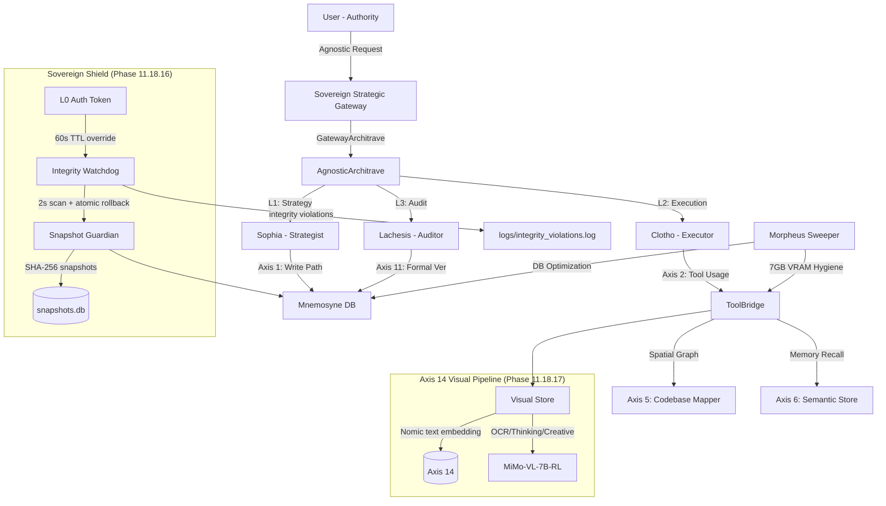
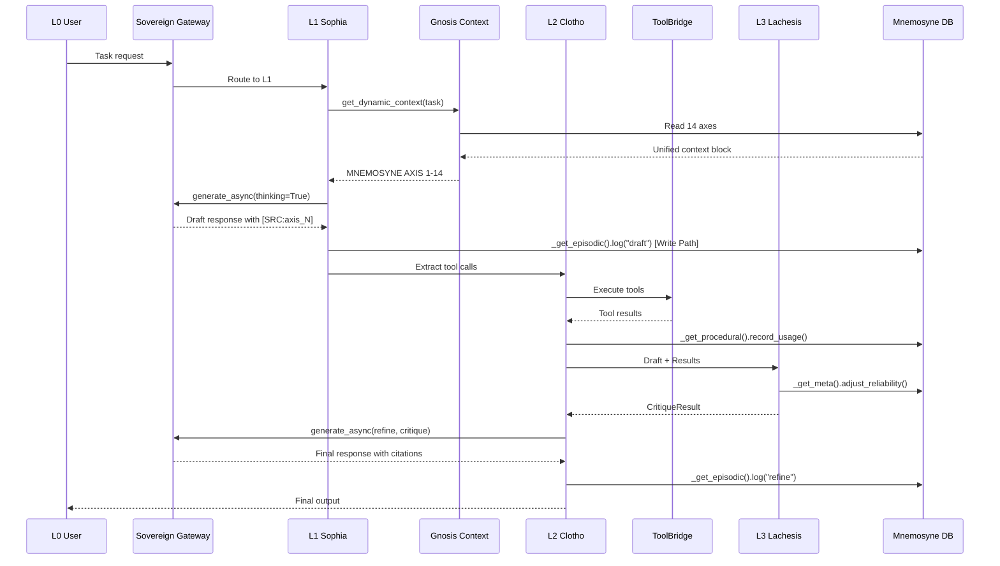

# Phantom Logos: System Topography & Micro-Level Data Flow
# Phantom Logos Topography (v1.0.0 Sovereign Baseline)
*Status: Phase 11.19.6 Stabilization COMPLETE — Modular Refactoring & Gateway Hardening*

This document provides a high-fidelity mapping of the Phantom Logos Agentic OS, detailing module interactions, data persistence across the 14-axis Mnemosyne memory, and the Sovereign Gateway architecture.

---

## 1. Executive Agent Hierarchy (L1-L3)

The system operates on a 3-Tier hierarchical structure (RuFlow) ensuring high-reasoning strategy is decoupled from deterministic execution and sovereign verification.



| Layer | Agent | Role | Model Tier | Axis Anchor |
| :--- | :--- | :--- | :--- | :--- |
| **L1** | **Sophia** | Strategist | Sovereign Gateway (Cloud) / Qwen 3.5 9B (Local) | Axis 10 (Rational) |
| **L2** | **Clotho** | Executor | Qwen 2.5 Coder 7B | Axis 2 (Procedural) |
| **L3** | **Lachesis** | Adversarial Auditor | Phi-4 Mini Reasoning / Qwen 2.5 Coder 3B | Axis 11 (Verification) |
| **L2** | **Atropos** | Context Engineer | Deterministic / Tiktoken | Axis 12 (Efficiency) |
| **L2** | **Morpheus** | VRAM Manager | Deterministic / Nvidia-SMI | Axis 7 (Operational) |
| **L3** | **Hermes** | Bridge Auditor | CLI / Cross-Session | Axis 13 (Cross-Session) |
| **L2** | **Sophia-14** | Vision Pipeline | MiMo-VL-7B-RL | Axis 14 (Visual) |

---

## 2. Sovereign Gateway Architecture

All cloud traffic routes through a single sovereign proxy layer, eliminating multi-client mismatch and external data leaks.

```mermaid
graph LR
    A[Sophia / Pydantic AI] -->|GoogleModel provider=gw.get_provider()| B[GatewayArchitrave]
    C[Manual reasoning calls] -->|generate_async| B
    B -->|SovereignProvider wraps genai.Client| D{ANTIGRAVITY_GATEWAY_URL}
    D -->|localhost:32553| E[Antigravity IDE Proxy]
    E -->|Secure Tunnel| F[Cloud Model Provider]
    B -->|Fallback if Gateway fails| G[Local Ollama / Muscle]
```

### Gateway Components

| Component | File | Responsibility |
|-----------|------|---------------|
| `GatewayArchitrave` | `src/architrave/gateway_client.py` | Unified gateway client with SovereignProvider |
| `SovereignProvider` | `src/architrave/gateway_client.py` | Pydantic AI compatible provider wrapping genai.Client |
| `SovereignProvider.get_provider()` | `gateway_client.py:86` | Returns configured provider for GoogleModel injection |
| `ANTIGRAVITY_GATEWAY_URL` | Env var / `gateway_client.py:68` | `http://localhost:32553` — local proxy endpoint |
| `api_key` | `gateway_client.py:72` | `"antigravity-native"` — dummy key for IDE routing |

### Key Design Decisions

- **Single-headed architecture:** Both Pydantic AI (`GoogleModel`) and native `GatewayArchitrave.generate_async()` use the same `genai.Client` instance, preventing context mismatch after 20-30 iterations.
- **SovereignProvider hijack:** Pydantic AI believes it is using a standard Google model, but all traffic routes through the local gateway.
- **Zero external dependency:** `gateway.pydantic.dev` is never called. All cloud traffic goes through `localhost:32553`.
- **Backward-compatible keys:** `GATEWAY_API_KEY` is the primary key; `GEMINI_API_KEY` is auto-mapped for legacy support.

---

## 3. Mnemosyne: 14-Axis Memory Topography

Mnemosyne maintains OS agility via autonomous pruning and strict 7GB VRAM hygiene. Each axis represents a distinct memory type with dedicated storage technology and lifecycle management.

| Axis | Name | Technology | Responsibility | Write Path |
| :--- | :--- | :--- | :--- | :--- |
| **1** | **Episodic** | SQLite (WAL) | Session event history and agent step logging. | `_get_episodic().log()` per Sophia step |
| **2** | **Procedural** | SQLite | Tool usage patterns and successful execution routes. | `_get_procedural().record_usage()` per tool call |
| **3** | **Goal** | SQLite | Active objectives and task state tracking. | `_get_goals().update()` per phase |
| **4** | **Temporal** | SQLite | Time-series event sequences and latency metrics. | `_get_temporal().record()` per operation |
| **5** | **Spatial** | SQLite | CodebaseMapper with AST parser + SQL LIKE optimization. Incremental remap with prune support. 71 modules, 276 edges persisted to `spatial.db`. | `_get_spatial().record_dependency()` on scan |
| **6** | **Semantic** | LanceDB + Hybrid | Vector + FTS (RRF Merge) + Jina Reranker (v3). | `_get_semantic().store()` per memory |
| **7** | **Operational** | SQLite + Sweeper | VRAM metrics, DB Pruning (30d retention), telemetry. Note: 30d raw retention may conflict with Axis 13 pattern analysis — archival strategy pending. | `_get_sweeper().log()` periodic |
| **8** | **Meta-Cog** | SQLite | Behavioral reliability tracking, execution failure analysis, agent success rates. | `_get_meta().adjust_reliability()` + `failure_memory` |
| **9** | **Creative** | ToneStore | Persona and communication style tokens. | Auto-updated via interaction analysis |
| **10** | **Rational** | SQLite | Formal logic, governance rules (`rules.json`), decision trees. | `_get_store().record_fact()` per governance rule |
| **11** | **Verification** | SymPy + Z3 + QWED | Sovereign local verification of mathematical/logical claims and expressions. | `sympy_verifier.verify_expression()` per technical claim |
| **12** | **Efficiency** | SQLite + ContextCacheStore | Context caching (Axis 12) for 1-hour TTL anchors. Cache eviction is TTL-based only; no active sweep integrated yet. | `architrave.create_context_cache()` on anchor build |
| **13** | **Cross-Session** | SQLite (External) | Cross-session bridge and inter-session pattern recognition (OpenCode). | `opencode_store.log()` via Hermes CLI |
| **14** | **Visual** | SQLite + VisualStore | VLM output storage with Nomic text embedding. 50-entry LRU retention, 30-day TTL. | `VisualStore.store_vision()` per vision call |

### Context Assembly (gnosis.py)

The `get_dynamic_context()` function in `cognition/sophia/gnosis.py` collects data from all 14 axes and assembles them into a unified context block with standardized `### MNEMOSYNE AXIS N` labels for consumption by Sophia and Pydantic AI.

```python
# Pseudocode flow
context = ""
context += _build_axis_1()   # Episodic History
context += _build_axis_2()   # Procedural Tools
context += _build_axis_3()   # Active Goals
context += _build_axis_4()   # Temporal Metrics
context += _build_axis_5()   # Spatial Codebase
context += _build_axis_6()   # Semantic Memory
context += _build_axis_7()   # Operational Telemetry
context += _build_axis_8()   # Meta-Cognition
context += _build_axis_9()   # User Tone
context += _build_axis_10()  # Rational Governance
context += _build_axis_11()  # Logical Verification
context += _build_axis_12()  # Efficiency Cache
context += _build_axis_13()  # Cross-Session Patterns
context += _build_axis_14()  # Visual Memory (VLM outputs)
```

---

## 4. Micro-Level Data Flow (Task Lifecycle)

### Full Request Lifecycle



### Future Features (Post 11.19.6)

| Feature | Status | Description |
|---------|--------|-------------|
| LightSandbox | Completed | `src/clotho/sandbox.py` — isolated code execution |
| Morpheus Config B | Completed | 4 model-set VRAM management (Default/Vision/Fast/Verify) |
| L3 Two-Pass Verification | Completed | Phi-4 Mini → low confidence → Qwen-7b verify |
| Ultra-Light L0 Tier | Completed | deepseek-1.5b as Tier 0 for rapid response |
| Modular Refactoring | Completed | ergon/bridge/gnosis/verifiers/mapper/eidos — 6 packages extracted from monoliths (Phase 11.19.5) |
| Gateway Hardening | Completed | Circuit breaker, 60s local fallback, MockResponse on failure, sweeper health check (Phase 11.19.6) |
| MCP Runtime | Proposed | Native MCP server integration for dynamic tool discovery |
| Distributed Memory | Proposed | Remote Mnemosyne sync across agent clusters |
| Axis 14 Visual | Completed | Visual memory store for OCR/scene analysis (Phase 11.18.17) |
| Sovereighty Shield | Completed | file_watchdog + snapshot_manager + L0 Auth Token (Phase 11.18.16) |
| Temporal Validity | Completed | event_key + supersede + fact history (Phase 11.19.1) |
| CORE_MODELS Protection | Completed | sync_from_ollama + keep_alive=-1 prevents model eviction (Phase 11.19.6) |
| SLM MCP Integration | Proposed | SuperLocalMemory V3.4 memory system via MCP |

---

## 5. Module Mapping

### 5.1 Source Code Architecture

| Module | Path | Lines/Files | Funcs | Role |
|--------|------|-------------|-------|------|
| `orchestrator` | `src/clotho/orchestrator.py` | 182 | 2 | LangGraph state machine, AsyncSqliteSaver checkpointer, deadlock_resolver node, spatial_context state |
| `ergon/` | `src/clotho/ergon/` | 12 files | 11 nodes | LangGraph node function package (symmachia, kathedra, horasis, grammateia, deigma, synergeia, elenchos, orthosis, theoria, aporia + koinonia helpers) |
| `bridge/` | `src/clotho/bridge/` | 6 files | 4 handlers | Tool dispatcher package (base + fs + retrieval + vision + verify) |
| `mapper_bridge` | `src/clotho/mapper_bridge.py` | 40 | 2 | Debounced incremental remap with asyncio Lock separation |
| `control_handoff` | `src/clotho/control_handoff.py` | 68 | 2 | Entry point with 120s global timeout |
| `bootstrap` | `src/clotho/bootstrap.py` | 185 | 9 | Morpheus daemon startup, CPU_HEAVY_EXECUTOR |
| `krisis` | `src/clotho/krisis.py` | 173 | 6 | Routing and decision logic, adaptive draft cycle (confidence>0.9 skip refine) |
| `activity` | `src/clotho/activity.py` | 26 | 1 | Singleton ActivityMonitor (thread-safe is_busy) |
| `skill_loader` | `src/clotho/skill_loader.py` | 109 | 7 | SKILL.md loader with YAML frontmatter parser |
| `agent_loader` | `src/clotho/agent_loader.py` | 138 | 8 | Agent YAML definitions registry |
| `gateway_client` | `src/architrave/gateway_client.py` | 244 | 18 | GatewayArchitrave + SovereignProvider, circuit breaker, 60s timeout, local fallback, MockResponse |
| `model_registry` | `src/architrave/model_registry.py` | 161 | 6 | Capability-based model resolution (benchmarks in `data/model_benchmarks.json`) |
| `context_cache` | `src/architrave/context_cache.py` | 172 | 2 | Axis 12 context caching |
| `opencode_store` | `src/architrave/opencode_store.py` | 117 | 6 | Cross-session bridge store |
| `entity_extractor` | `src/architrave/entity_extractor.py` | 119 | 7 | Entity extraction for graph |
| `mapper/` | `src/lachesis/mapper/` | 3 files | 2 classes | Codebase dependency graph (AST parser + GraphManager/CodebaseMapper) |
| `verifiers/` | `src/lachesis/verifiers/` | 6 files | 4 engines | Axis 11: SymPy+Z3+QWED+LLM verification, 6-pillar evaluator, output guard |
| `file_watchdog` | `src/lachesis/file_watchdog.py` | 94 | 6 | Sovereign Shield: OS-level file integrity, 30s polling, mtime change detection (Phase 11.18.16) |
| `snapshot_manager` | `src/lachesis/snapshot_manager.py` | 109 | 8 | Sovereign Shield: Periodic SHA-256 snapshots of 120 critical files (Phase 11.18.16) |
| `self_tuner` | `src/lachesis/self_tuner.py` | 77 | 6 | Meta-cognitive performance tuning |
| `sophia` | `cognition/sophia/sophia.py` | 285 | 4 | Core reasoning: draft, critique, refine |
| `gnosis/` | `cognition/sophia/gnosis/` | 16 files | 14 axis builders | 14-axis context assembly package (stable/dynamic split, JSON minification) |
| `hephaestus` | `cognition/sophia/hephaestus.py` | 296 | 24 | Singleton getters, schemas from `.eidos`, SovereignProvider injection, JIT scan_pattern |
| `eidos` | `cognition/sophia/eidos.py` | new | 5 schemas | Pydantic models: TechnicalClaim, SophiaOutput, InconsistencyEvidence, ReasoningState, CritiqueResult |
| `sweeper` | `cognition/morpheus/sweeper.py` | 405 | 17 | VRAM fragmentation cleanup, heal_ollama, gateway health check, weekly/monthly summary |
| `scheduler` | `cognition/morpheus/scheduler.py` | 148 | 9 | Load/unload scheduler, periodic 30s tick |
| `loader` | `cognition/morpheus/loader.py` | 89 | 7 | Ollama model loader with CORE_MODELS protection, `sync_from_ollama()`, `keep_alive=-1` |
| `vram_config` | `cognition/morpheus/vram_config.py` | new | constants | CORE_MODELS list, VRAM budget constants |
| `visual_store` | `cognition/mnemosyne/visual_store.py` | 171 | 10 | Axis 14: Visual memory store with Nomic text embedding |
| `file_changelog` | `cognition/mnemosyne/file_changelog.py` | 167 | 10 | Append-only file change audit log (watchdog backing store) |
| `episodic_store` | `cognition/mnemosyne/episodic_store.py` | 131 | 9 | Axis 1: Session logging with Write Path |
| `procedural_store` | `cognition/mnemosyne/procedural_store.py` | 103 | 5 | Axis 2: Tool usage history |
| `goal_store` | `cognition/mnemosyne/goal_store.py` | 105 | 7 | Axis 3: Active objectives |
| `temporal_store` | `cognition/mnemosyne/temporal_store.py` | 270 | 10 | Axis 4: Time-series metrics (singleton initialization) |
| `spatial_store` | `cognition/mnemosyne/spatial_store.py` | 204 | 12 | Axis 5: SQLite dependency graph + query_by_keywords + prune_deleted_module |
| `semantic_store` | `cognition/mnemosyne/semantic_store.py` | 271 | 13 | Axis 6: LanceDB hybrid search |
| `operational_store` | `cognition/mnemosyne/operational_store.py` | 103 | 6 | Axis 7: System health |
| `meta_cognition` | `cognition/mnemosyne/meta_cognition.py` | 286 | 12 | Axis 8: Reliability + failure memory |
| `tone_store` | `cognition/mnemosyne/tone_store.py` | 113 | 6 | Axis 9: Creative persona |
| `rational_store` | `cognition/mnemosyne/rational_store.py` | 112 | 8 | Axis 10: Governance and facts |
| `reflection_store` | `cognition/mnemosyne/reflection_store.py` | 117 | 11 | Axis 11: Verification records |
| `session_log` | `cognition/mnemosyne/session_log.py` | 100 | 6 | Session event log |
| `memory_arbitrator` | `cognition/mnemosyne/memory_arbitrator.py` | 54 | 4 | Memory scoring engine |
| `base` | `cognition/mnemosyne/base.py` | 6 | 0 | SQLAlchemy base |
| `ollama_utils` | `src/utils/ollama_utils.py` | 14 | 1 | Singleton AsyncClient (Phase 11.18.5) |

### 5.2 Dependency Graph (Top 10 Modules by Edge Count)

| Source Module | Dependencies |
|---------------|-------------|
| `clotho.ergon` | `clotho.bridge`, `lachesis.verifiers`, `mnemosyne.*` |
| `sophia.hephaestus` | `mnemosyne.*`, `architrave.model_registry`, `lachesis.mapper` |
| `sophia.gnosis` | `mnemosyne.*`, `architrave.gateway_client`, `lachesis.mapper` |
| `clotho.orchestrator` | `clotho.ergon`, `clotho.bridge`, `lachesis.verifiers` |
| `lachesis.mapper` | `mnemosyne.spatial_store` |
| `clotho.mapper_bridge` | `lachesis.mapper`, `mnemosyne.spatial_store` |
| `muscle.local_runtime` | Subprocess management for llama.cpp |

Total: **71 modules, 276 edges** (174 stdlib, 101 project, 1 import)

---

## 6. Complete File Tree

```
D:\HANK/
|-- .antigravity/                        # SOVEREIGN KNOWLEDGE BASE
|   |-- topography.md                    # This file: system map
|   |-- tools.md                         # Tool inventory & capability matrix
|   |-- rules.json                       # Machine-readable governance (15 rules)
|   |-- schema.sql                       # Database schema (SSOT)
|   |-- restoration.md                   # Disaster recovery plan
|   |-- CONSTITUTION.md                  # Core system laws (Absolute Agnosticism)
|   |-- AGENTS.md                        # [MERGED TO ROOT]
|   |-- IDENTITY.md                      # Cognitive profile (14-Axis Aware)
|   |-- CONTRIBUTING.md                  # Standards for extending axes/tools
|   |-- README.md                        # .antigravity sub-documentation
|   |-- SECURITY.md                      # Sovereign secret management policy
|   |-- audit/                           # Audit records
|   |   |-- phase_11_10.md              # Security hardening audit
|   |   |-- session_transparency.md      # Session transparency log
|   |   |-- legacy/                      # Historical archives
|   |-- walkthroughs/                    # Execution history
|   |   |-- main_walkthrough.md          # Master execution record
|   |   |-- debug_log.md                 # Debug trace
|   |-- dev/                             # Developer workspace
|       |-- ROADMAP.md                   # Future roadmap
|       |-- TASKS.md                     # Active task list
|
|-- src/                                 # SOURCE CODE
|   |-- clotho/                          # LangGraph orchestration (L2 Executor)
|   |   |-- orchestrator.py              # Spine: Graph construction + AsyncSqliteSaver
|   |   |-- ergon/                       # Work: LangGraph node functions (11 nodes)
|   |   |   |-- symmachia.py             # negotiate_node
|   |   |   |-- kathedra.py              # anchor_inject_node
|   |   |   |-- horasis.py               # vision_node
|   |   |   |-- grammateia.py            # draft_node, expert_draft_node
|   |   |   |-- deigma.py                # verify_node
|   |   |   |-- synergeia.py             # tool_exec_node
|   |   |   |-- elenchos.py              # critique_node
|   |   |   |-- orthosis.py              # refine_node
|   |   |   |-- theoria.py               # reflection_node
|   |   |   |-- aporia.py                # deadlock_resolver_node
|   |   |   |-- koinonia.py              # Internal helpers (_verify_draft_sync, _verify_critique_sync)
|   |   |-- bridge/                      # Tool dispatcher package
|   |   |   |-- base.py                  # ToolBridge (execute + ActivityMonitor)
|   |   |   |-- fs.py                    # File system tool handlers
|   |   |   |-- retrieval.py             # Semantic search handler
|   |   |   |-- vision.py                # Vision pipeline handler
|   |   |   |-- verify.py                # Verification handler
|   |   |-- krisis.py                    # Judgment: Routing and decision logic
|   |   |-- bootstrap.py                 # Morpheus daemon startup
|   |   |-- agent_loader.py              # Agent YAML definitions
|   |   |-- skill_loader.py              # SKILL.md capability loader
|   |   |-- mapper_bridge.py             # Debounced incremental remap (Phase 11.18.10)
|   |   |-- control_handoff.py           # Task handoff entry point (120s timeout)
|   |   |-- activity.py                  # Singleton ActivityMonitor (Phase 11.20)
|   |-- lachesis/                        # L3 Audit & Verification
|   |   |-- __init__.py                  # Lazy import entry point
|   |   |-- mapper/                      # Codebase dependency graph (AST parser + GraphManager/CodebaseMapper)
|   |   |-- verifiers/                   # 4-engine verification (SymPy + Z3 + QWED + LLM)
|   |   |   |-- evaluator.py             # 6-pillar adversarial evaluator
|   |   |   |-- output_guard.py          # Output rule enforcement
|   |   |-- file_watchdog.py             # File integrity watchdog (Phase 11.18.16)
|   |   |-- snapshot_manager.py          # SHA-256 snapshot manager (Phase 11.18.16)
|   |   |-- self_tuner.py                # Meta-cognitive performance tuning
|   |-- architrave/                      # Cloud connectivity (Gateway)
|   |   |-- gateway_client.py            # GatewayArchitrave + SovereignProvider
|   |   |-- context_cache.py             # Context caching (Axis 12)
|   |   |-- model_registry.py            # Capability-based model registry
|   |   |-- opencode_store.py            # Cross-session bridge store
|   |   |-- entity_extractor.py          # Entity extraction for graph
|   |-- atropos/                         # Context engineering (L2)
|   |   |-- context_pruner.py            # Token-aware context pruning
|   |   |-- token_budget.py              # Rate limiter and budget guard
|   |   |-- observability.py             # Telemetry and tracing (Axis 4)
|   |-- muscle/                          # Local runtime (L0-L1)
|   |   |-- local_runtime.py             # llama.cpp subprocess manager
|   |   |-- reranker.py                  # Jina reranker wrapper
|   |-- ankyra/                          # Context anchoring (L1)
|   |   |-- anchor_generator.py          # JIT XML anchor builder
|   |-- utils/                           # Shared utilities
|       |-- logging_config.py            # SQLite logging handler
|       |-- image_optimizer.py           # VLM image preprocessing
|       |-- security_utils.py            # Keyring secret loader (Gateway API)
|       |-- ollama_utils.py              # Singleton AsyncClient (Phase 11.18.5)
|
|-- cognition/                           # COGNITIVE LAYER
|   |-- sophia/                          # Tier-1 Reasoning (Sophia)
|   |   |-- sophia.py                    # Core reasoning: draft/critique/refine
|   |   |-- gnosis/                      # 14-axis context assembly (stable/dynamic split)
|   |   |   |-- base.py                  # get_dynamic_context() orchestrator
|   |   |   |-- axis_1_episodic.py ... axis_14_visual.py  # Individual axis builders (14 files)
|   |   |-- hephaestus.py                # Singleton getters + SovereignProvider injection
|   |   |-- eidos.py                     # Pydantic schemas (5 models)
|   |   |-- router.py                    # Task capability classification
|   |   |-- tool_validator.py            # Tool JSON schema validator
|   |   |-- state_bus.py                 # Agent message bus
|   |   |-- sprint_contract.py           # DOD negotiation
|   |   |-- temperature_control.py       # Temperature profiles
|   |-- mnemosyne/                       # 14-Axis Memory
|   |   |-- episodic_store.py            # Axis 1: Event stream + Write Path
|   |   |-- procedural_store.py          # Axis 2: Tool usage history
|   |   |-- goal_store.py                # Axis 3: Active objectives
|   |   |-- temporal_store.py            # Axis 4: Time-series metrics
|   |   |-- spatial_store.py             # Axis 5: Codebase graph
|   |   |-- semantic_store.py            # Axis 6: LanceDB hybrid search
|   |   |-- operational_store.py         # Axis 7: System health
|   |   |-- meta_cognition.py            # Axis 8: Self-awareness + failure memory
|   |   |-- tone_store.py                # Axis 9: Creative persona
|   |   |-- rational_store.py            # Axis 10: Governance and facts
|   |   |-- reflection_store.py          # Axis 11: Verification records
|   |   |-- memory_arbitrator.py         # Memory scoring engine
|   |   |-- session_log.py               # Session event log
|   |   |-- base.py                      # SQLAlchemy base
|   |-- morpheus/                        # L2 VRAM Manager
|       |-- sweeper.py                   # VRAM sweep + prune + heal_ollama + gateway health check
|       |-- scheduler.py                 # Load/unload scheduler
|       |-- loader.py                    # Ollama model loader (CORE_MODELS, sync_from_ollama, keep_alive=-1)
|       |-- monitor.py                   # nvidia-smi telemetry
|       |-- registry.py                  # Model fitting logic
|       |-- vram_config.py               # CORE_MODELS list, VRAM budget constants
|
|-- scripts/                             # CLI TOOLS
|   |-- hermes_cli.py                    # Mnemosyne bridge CLI
|   |-- discover_id.py, verify_models.py, test_bridge_hardening.py
|
|-- tests/                               # TEST SUITE
|   |-- test_axis_stability.py           # 14-axis stability audit
|   |-- test_full_pipeline.py            # End-to-end pipeline test
|   |-- (34 test files total)
|
|-- data/                                # RUNTIME DATA (gitignored)
|   |-- mnemosyne.db                     # SQLite memory store
|   |-- spatial.db                       # Spatial dependency graph
|   |-- lancedb/                         # Vector and temporal stores
|   |-- langgraph_checkpoints.sqlite     # AsyncSqliteSaver persistence
|   |-- model_benchmarks.json            # Extracted model benchmark data
|   |-- snapshots.db                     # Sovereign Shield SHA-256 snapshots
|   |-- reliability.db                   # Agent reliability metrics
|
|-- agent/                               # AGENT YAML DEFINITIONS + SKILLS
|   |-- sophia.yaml                      # Sophia agent config (13 axes)
|   |-- clotho.yaml                      # Clotho execution profile
|   |-- ...hermes.yaml, lachesis.yaml, atropos.yaml, morpheus.yaml
|   |-- skills/                          # SKILL CAPABILITY FILES (23 total)
|       |-- agent-orchestrator/          # Complex project management
|       |-- code-generation/             # Production code implementation
|       |-- discovery-mcp-scanner/       # MCP JIT tool discovery
|       |-- (19 more skills...)
|
|-- docs/                                # AUXILIARY DOCS
|-- scratch/                             # LOCAL ARTIFACTS (gitignored)
|-- .venv/                               # Python virtual env (gitignored)
|-- .antigravity/                        # Governance symlink reference
```


---

## 7. Local Model Inventory & VRAM Matrix

### Active Model Pool (23 models)

| Role | Model | VRAM (GB) | Runtime | Tier |
|------|-------|-----------|---------|------|
| L1 Strategist | Sovereign Gateway (Cloud) | — | Gateway | Expert |
| L1 Local Alt | Qwen 3.5 9B UD | 5.5 | Ollama | Expert |
| L2 Primary | Qwen 2.5 Coder 7B | 4.7 | Ollama | Primary |
| L2 Light | Ministral 3B Reasoning | 2.2 | Ollama | Light |
| L2 Ultra-Light | DeepSeek 1.5B | 1.2 | Ollama | Ultra-Light |
| L3 Auditor | Phi-4 Mini Reasoning UD | 2.8 | Ollama | Verification |
| L3 Verification | Qwen 2.5 Coder 3B Q6 | 2.5 | Ollama | Axis 11 |
| L3 Fallback | Qwen 2.5 Coder 0.5B | 0.5 | Ollama | Axis 11 |
| Router | Granite 3B | 1.6 | Ollama | RuFlow |
| Vision Flagship | MiMo-VL-7B-RL | 5.7 | LocalRuntime | Vision |
| Vision OCR | Qwen2-VL OCR 2B | 1.1 | LocalRuntime | Vision (BYPASSED: MiMo-VL primary) |
| Vision General | Qwen2.5-VL 3B | 2.5 | LocalRuntime | Vision (BYPASSED: MiMo-VL primary) |
| Vision Thinking | Qwen3-VL Thinking 4B | 3.15 | LocalRuntime | Vision (BYPASSED) |
| Vision Creative | Gemma 4 E4B 4B | 5.67 | LocalRuntime | Vision (BYPASSED) |
| Embedding | Nomic Embed MoE Q8 | 0.5 | Ollama | Axis 6 |
| Reranker | Jina Reranker V3 | 0.6 | Muscle | Retrieval |
| Math Verifier | Qwen 2.5 Math 7B | 4.0 | Ollama | Axis 11 |
| Math Light | DeepScaler 1.5B | 1.1 | Ollama | Axis 11 |
| Tool Calling | FunctionGemma 270M | 0.3 | Ollama | RuFlow |
| L2 Fallback | Granite 4.1 8B | 5.5 | Ollama | Draft |
| L2 Alternative | Hermes-3 Llama 8B | 4.9 | Ollama | Draft |
| L2 Alternative | Llama 3.1 8B | 4.9 | Ollama | Draft |
| L0 Alternative | SmolLM2 1.7B | 1.2 | Ollama | Ultra-Light |
| L0 Tiny | Llama 3.2 1B | 0.9 | Ollama | Ultra-Light |

Full benchmark data (MMLU, HumanEval, MATH, tokens/sec) available in `.antigravity/tools.md` and `model_registry.MODEL_BENCHMARKS`.

### Operating Modes (8GB VRAM Constraint)

| Mode | Active Models | VRAM | Use Case |
|------|--------------|------|----------|
| **A: Standard** | Qwen 7B (always) + Phi-4 Mini (on audit) | 4.7 GB idle / 7.5 GB peak | Normal agentic loop (need_based: Phi-4 loads only during audit) |
| **B: Vision** | 2x Vision + Qwen 3B | 6.1 GB | Document/UI analysis |
| **C: Fast** | Ministral + Granite + DeepSeek | 5.0 GB | Rapid response |
| **D: Verification** | Qwen 7B + Qwen 3B | 7.2 GB | Heavy logic/code audit |

| Mode | Active Models | VRAM | Use Case |
|------|--------------|------|----------|
| **A: Standard** | Qwen 7B (always) + Phi-4 Mini (on audit) | 4.7 GB idle / 7.5 GB peak | Normal agentic loop (need_based: Phi-4 loads only during audit) |
| **B: Vision** | 2x Vision + Qwen 3B | 6.1 GB | Document/UI analysis |
| **C: Fast** | Ministral + Granite + DeepSeek | 5.0 GB | Rapid response |
| **D: Verification** | Qwen 7B + Qwen 3B | 7.2 GB | Heavy logic/code audit |

Always resident: Nomic Embed (0.5 GB) + Jina Reranker (0.6 GB) = 1.1 GB

---

## 8. Connection Map

```
[L0 User]
    |
    |-- Antigravity IDE (Web/Desktop)
    |       |
    |       |-- http://localhost:32553 (Sovereign Gateway Proxy)
    |       |       |
    |       |       |-- GatewayArchitrave -> genai.Client -> Cloud Models
    |       |
    |       |-- http://localhost:11434 (Ollama API)
    |       |       |
    |       |       |-- Local GGUF models (GPU: NVIDIA RTX 4070 8GB)
    |       |
    |       |-- D:\Hank\ (Volume Mount / Workspace)
    |               |
    |               |-- .venv/ (Python 3.12)
    |               |-- data/ (SQLite + LanceDB)
    |               |-- logs/ (Execution logs)
    |
    |-- OpenCode CLI (Cross-Session Bridge)
            |
            |-- Hermes CLI -> Mnemosyne DB (Cross-Session: Hermes reads patterns, Sophia writes via _get_episodic().log())
```

---

## 9. Hardware Platform

| Component | Specification | Impact |
|-----------|--------------|--------|
| GPU | NVIDIA RTX 4070 Laptop 8GB GDDR6 | Max 2 concurrent LLMs, strict swap policy |
| CPU | Intel i7-13620H (6P + 4E cores) | E-cores for background tasks (pruning, mapping) |
| RAM | 32 GB DDR4 | Mnemosyne DB (~2-5 GB), Python runtime (~1-2 GB) |
| Storage | 2TB Samsung Pro NVMe | GGUF models (~50 GB), DB (~10 GB) |

### VRAM Budget

| Allocation | GB |
|------------|----|
| Total GPU VRAM | 8.0 |
| Windows OS reservation | 1.0 |
| Embedding + Reranker (Always resident) | 1.1 |
| Available for LLMs | 5.9 |

---

## 10. External Dependencies

| Resource | Location | Purpose |
|----------|----------|---------|
| Ollama Models (Blobs) | `D:\Google\AntiGravity\General Tools\OllamaModels\blobs\` | 73 files ~67 GB — Ollama-managed GGUF blobs |
| Raw GGUF Files | `D:\Google\AntiGravity\General Tools\` | 32 standalone GGUF files (RAW, not in Ollama) |
| Ollama Modelfiles | `D:\Google\AntiGravity\General Tools\OllamaModels\` | 41 `.Modelfile` definitions mapping GGUF -> Ollama tags |
| Vision Models | `D:\Google\AntiGravity\General Tools\VisionSandbox\` | MiMo-7B (flagship), plus Qwen2.0-2B, Qwen2.5-3B, Qwen3-4B, Gemma4B — ~17 GB |
| Python 3.12 | `.venv\` | Isolated runtime environment |
| Antigravity IDE | External | Client interface and cloud proxy tunnel |

---

## 11. Key Decision Record (ADR)

| Decision | Status | Rationale |
|----------|--------|-----------|
| Phantom Logos v1.0.0 | SEALED | Rebrand from Phantom Logos to eliminate Claude model confusion. "Logos" = Universal Reason/Order. |
| Absolute Agnosticism | ENFORCED | No hardcoded model names. All traffic via Sovereign Gateway. `GATEWAY_API_KEY` primary. |
| SovereignProvider Injection | ACTIVE | Pydantic AI hijacked via custom `Provider[genai.Client]` to enforce local gateway routing. |
| 14-Axis Standardization | ACTIVE | All memory axes use `MNEMOSYNE AXIS N` format for consistent context assembly. |
| [SRC:axis_N] Citation | MANDATORY | Every claim cites its source axis. Enforced in both Draft and Refine stages. |
| Sophia Write Path | ACTIVE | Every agent step logged to Axis 1 via `episodic_store.log()`. |
| 7GB VRAM Budget | ENFORCED | Hard limit via `Morpheus.flush()` between heavy model transitions. |
| Phase Number Reset | SEALED | Previous 11.x series consolidated into v1.0.0. Clean baseline for future iterations. |
| Transport Hardening | ACTIVE | `httpx` transport hardened with `trust_env=False` to prevent socket hangs (Phase 11.18.5). |
| Ollama Singleton Client | ACTIVE | Shared `ollama.AsyncClient()` across 6 modules to prevent socket leaks (Phase 11.18.5). |
| CPU Pool Limiting | ACTIVE | `CPU_HEAVY_EXECUTOR` with `max_workers=4` to prevent CPU saturation (Phase 11.18.5). |
| Phantom Skill Recovery | COMPLETED | 10 missing SKILL.md files created, parser upgraded to `yaml.safe_load()` (Phase 11.19). |
| Dynamic Agent Selection | ACTIVE | Sophia monolith broken: task type routes to Sophia/Clotho/Lachesis dynamically (Phase 11.18.6). |
| Hallucination Spiral Fix | ACTIVE | `krisis.py` bypass removed: 3 failed audits trigger `deadlock_resolver` instead of forced pass (Phase 11.18.6). |
| Skill Consolidation | COMPLETED | `skills/` moved to `agent/skills/`, root-tied to agent YAML definitions (Phase 11.19/11.18.7). |
| Documentation Rebrand | COMPLETED | 10 files rebranded from Phantom Logos to Phantom Logos, 14-axis synced (Phase 11.18.7). |
| OutputGuard Pipeline | ACTIVE | OutputGuard wired into verify_node + refine_node. BA-01 is_user_interaction exemption (Phase 11.18.8). |
| Thinking Param Fix | ACTIVE | `thinking=True` in sophia.py → `thinking_config` in gateway_client.py to prevent ValidationError (Phase 11.18.8). |
| Two-Stage Reranking | ACTIVE | Nomic embedding (100 candidates) → Jina reranker (top 5). No MS-MARCO model needed (Phase 11.18.9). |
| AST Codebase Mapper | ACTIVE | Regex → `ast.parse`. SQL LIKE optimization. Incremental remap + prune. Thread-safe singleton (Phase 11.18.10). |
| Sovereign Shield | ACTIVE | file_watchdog.py + snapshot_manager.py + L0 Auth Token. Pre-write integrity check with 10% data loss threshold (Phase 11.18.16). |
| Axis 14 Visual | ACTIVE | VisualStore with Nomic text embedding. 50-entry LRU retention + 30-day TTL. 4 variant vision routing (Phase 11.18.17). |
| Temporal Validity | ACTIVE | event_key + supersede() + get_fact_at() for temporal graph queries on Axis 4 (Phase 11.19.1). |
| OpenCode Instructions | ACTIVE | agents now see tools.md and DEEPSEEK_CMD.md via opencode.json (Phase 11.19.1). |
| MODEL_BENCHMARKS | ACTIVE | 23 models with MMLU/HumanEval/MATH/tokens_per_sec loaded in model_registry.py (Phase 11.19.1). |
| Modular Refactoring | COMPLETED | ergon/tool_bridge/gnosis/sympy_verifier/codebase_mapper → subpackages. eidos schema extraction. 3 monoliths deleted (Phase 11.19.5). |
| Stable/Dynamic Context | ACTIVE | gnosis/get_dynamic_context returns (stable, dynamic, block_signal) tuple. Stable = Axes 9-13 + instructions (system_instruction). Dynamic = Axes 1-8,14 (prompt). JSON minification (Phase 11.19.5). |
| Adaptive Draft Cycle | ACTIVE | krisis.py: skip refine_node if confidence > 0.9. Token telemetry logged. Reranker fast-path for <15 char queries (Phase 11.19.5). |
| Gateway Hardening | ACTIVE | async_retry with asyncio.sleep, Circuit Breaker (60s cooldown), local fallback on channel-full/500/503. `_local_fallback` timeout 30s→60s. MockResponse on failure (Phase 11.19.6). |
| TemporalStore Singleton | ACTIVE | Module-level `_initialized` flag, `initialize_temporal_schema()` called once. ~43K daily redundant SQL queries eliminated (Phase 11.19.5). |
| Watchdog Optimization | ACTIVE | Polling interval 2s→30s, mtime-based change detection. ~90% CPU reduction (Phase 11.19.5). |
| CORE_MODELS Protection | ACTIVE | `vram_config.CORE_MODELS` (qwen2-5-coder-7b, tinyllama). `sync_from_ollama()` detects IDE-loaded models. `keep_alive=-1` prevents auto-eviction (Phase 11.19.6). |

---

## 12. Version History

| Version | Date | Summary |
|---------|------|---------|
| 11.19.6 | 2026-05-09 | **Stabilization & Gateway Hardening.** Gateway circuit breaker, 60s local fallback, MockResponse on failure, sweeper health check. CORE_MODELS protection with `sync_from_ollama()` + `keep_alive=-1`. Embedding Pydantic fix. `ReasoningState.error_message` field. TemporalStore singleton (~43K daily SQL queries eliminated). Watchdog 2s→30s polling (~90% CPU reduction). |
| 11.19.5 | 2026-05-09 | **Modular Refactoring.** `ergon.py` → 12-file `ergon/` package. `tool_bridge.py` → 6-file `bridge/` package. `gnosis.py` → 16-file `gnosis/` package. `sympy_verifier.py` → 6-file `verifiers/` package. `codebase_mapper.py` → 3-file `mapper/` package. `eidos.py` schema extraction. 3 monolithic files deleted. Stable/Dynamic context split. |
| 11.19.1 | 2026-05-08 | **Temporal Validity + Axis 14 + Sovereign Shield Docs.** `event_key` supersede lifecycle. visual_store.py deployed. topography.md and opencode.json synced with tools.md benchmarks. |
| 11.18.17 | 2026-05-08 | **Axis 14 Visual Pipeline.** VisualStore with Nomic text embedding, 4-variant VLM routing, vision-aware RuFlow tier enforcement, L3 vision audit, image optimizer EXIF fix. |
| 11.18.16 | 2026-05-08 | **Sovereign Shield.** Snapshot Guardian (30s SHA-256), Integrity Watchdog (2s scan + atomic rollback), L0 Auth Token (60s TTL), integrity violations logging. |
| 11.18.15 | 2026-05-08 | **VRAM & Performance Hardening.** Dynamic `MODEL_SETS` and `EVICTION_ORDER`. CUDA OOM recovery with emergency flush. E-core process affinity (cores 12-15) for background daemons. |
| 11.18.10 | 2026-05-07 | **Codebase Mapper Hardening.** AST migration (regex→ast.parse). SQL LIKE optimization. Incremental remap + prune. Circular detection. Thread-safe singleton. Debounced remap loop. |
| 11.18.9 | 2026-05-07 | **Two-Stage Reranking.** Nomic (100 candidates) → Jina (top 5) cascade. Semantic pool 5x larger at +0.1s overhead. MS-MARCO bypassed. |
| 11.18.8 | 2026-05-07 | **Sovereign Hardening.** OutputGuard pipeline. l0_approved gate. Z3 verification. Thinking param fix. XML+few-shot prompts. Model blacklist fix. BA-01 exemption. |
| 11.18.7 | 2026-05-07 | **Documentation Alignment.** Global rebrand (Logos→Logos). 14-axis sync across all docs. Roadmap/walkthrough updated to 11.18.x series. |
| 11.18.6 | 2026-05-07 | **True Agency.** Dynamic agent selection (Sophia/Clotho/Lachesis). Hallucination spiral fix. deadlock_resolver node. 5 new SOTA skills (total 23). |
| 11.19 | 2026-05-07 | **Skill Restructuring.** 10 phantom SKILL.md files created. `yaml.safe_load()` parser upgrade. AGENTS.md merge. Root cleanup. |
| 11.18.5 | 2026-05-07 | **System Hardening.** Transport hardening (trust_env=False). Ollama singleton client. CPU_HEAVY_EXECUTOR (max_workers=4). EntityExtractor thread-safety. Event loop offloading. |
| v1.0.0 | 2026-05-07 | **Sovereign Rebirth.** Phantom Logos rebrand. Absolute Agnosticism. SovereignProvider injection. 14-Axis standardization. Sophia Write Path. Spatial Graph intelligence. All previous 11.x iterations consolidated. |
| 11.18.4 | 2026-05-07 | 14-Axis expansion. Sovereign Citation. Gnosis refactor. Spatial Mapper upgrade. |
| 11.18.3 | 2026-05-07 | SovereignProvider development. GatewayArchitrave unification. Pydantic AI injection. |
| 11.18.2 | 2026-05-07 | Async persistence (AsyncSqliteSaver). ActivityMonitor. Event loop hardening. Timeout layers. |
| 11.18.1 | 2026-05-07 | Agnostic Gateway. Capability mapping. SDK masking. Model registry purge. |
| 11.13 | 2026-05-05 | Sovereign Knowledge Base Consolidation. Temporal store. ToneStore. ContextCache. 7-pillar evaluation. Shell tool removal. |
| 1.0.0 | 2026-05-03 | Initial baseline. 12-axis architecture. RuFlow 3-Tier orchestration. |

---

*Created by Antigravity (Phantom Logos)*
*Last Updated: 2026-05-09 [01:45 AM PT]*
*Status: Phase 11.19.6 Stabilization COMPLETE*
